# AI/SW 개발 워크스테이션 구축

## 1. 실행 환경

```bash
$ pwd
/Users/10hour0574/dev-workstation-setup

$ uname -a
Darwin c4r6s1.codyssey.kr 24.6.0 Darwin Kernel Version 24.6.0: Mon Jan 19 22:00:10 PST 2026; root:xnu-11417.140.69.708.3~1/RELEASE_X86_64 x86_64

$ echo $SHELL
/bin/zsh

$ docker --version
Docker version 28.5.2, build ecc6942

$ docker info
WARNING: DOCKER_INSECURE_NO_IPTABLES_RAW is set
Client:
 Version:    28.5.2
 Context:    orbstack
 Debug Mode: true
 Plugins:
  buildx: Docker Buildx (Docker Inc.)
    Version:  v0.29.1
  compose: Docker Compose (Docker Inc.)
    Version:  v2.40.3

Server:
 Containers: 1
  Running: 0
  Paused: 0
  Stopped: 1
 Images: 12
 Server Version: 28.5.2
 Storage Driver: overlay2

$ git --version
git version 2.53.0
```

명령어 설명:

1. `pwd`
`pwd` 는 현재 작업 중인 디렉터리의 절대 경로를 출력하는 명령이다. 여기서 나온 `/Users/10hour0574/dev-workstation-setup` 는 내가 이 과제를 수행한 저장소 루트 위치를 의미한다.

2. `uname -a`
`uname -a` 는 현재 시스템의 커널과 아키텍처 정보를 한 줄로 보여 주는 명령이다. 출력 결과의 `Darwin` 은 macOS 계열 커널임을 뜻하고, 마지막의 `x86_64` 는 이 환경이 64비트 Intel 아키텍처 기준으로 동작하고 있음을 의미한다.

3. `echo $SHELL`
`echo $SHELL` 은 현재 사용자가 기본으로 사용하는 셸 프로그램 경로를 확인하는 명령이다. 출력값 `/bin/zsh` 는 이 과제에서 사용한 기본 셸이 `zsh` 라는 뜻이다.

4. `docker --version`
`docker --version` 은 Docker CLI 가 설치되어 있는지와 버전이 무엇인지 확인하는 명령이다. 출력값 `Docker version 28.5.2, build ecc6942` 는 Docker 명령어가 정상 설치되어 있고, 현재 사용한 버전이 `28.5.2` 임을 의미한다.

5. `docker info`
`docker info` 는 Docker CLI 자체가 아니라 실제 Docker 엔진이 동작 중인지, 어떤 컨텍스트와 스토리지 드라이버를 사용하는지까지 보여 주는 점검 명령이다. 이번 출력에서 `Context: orbstack` 은 OrbStack 환경에 연결되어 있음을 뜻하고, `Server Version: 28.5.2` 는 Docker 데몬이 실제로 동작 중임을 의미한다. 또한 `Containers: 1`, `Images: 12` 는 조회 시점 기준으로 엔진 안에 컨테이너와 이미지가 각각 몇 개 있었는지를 보여 준다.

6. `git --version`
`git --version` 은 Git 이 설치되어 있는지와 버전을 확인하는 명령이다. 출력값 `git version 2.53.0` 은 이 과제에서 사용한 Git 버전이 `2.53.0` 임을 의미한다.

재현성 주의사항:

- 이 저장소에서 사용한 실제 경로는 `/Users/10hour0574/dev-workstation-setup` 이다.
- 다른 PC에서는 같은 저장소를 clone 한 뒤 자신의 작업 경로로 바꿔 읽으면 된다.
- 경로를 문서화할 때는 절대 경로 예시와 함께 `$PWD`, 상대 경로를 병기하면 재현성이 좋아진다.

## 2. 터미널 기본 조작

```bash
$ cd /Users/10hour0574/dev-workstation-setup/practice

$ pwd
/Users/10hour0574/dev-workstation-setup/practice

$ ls -la
total 0
drwxr-xr-x   4 c10hour0574  c10hour0574  128 Apr  3 03:01 .
drwxr-xr-x  11 c10hour0574  c10hour0574  352 Apr  3 02:31 ..
drwxr-xr-x   4 c10hour0574  c10hour0574  128 Apr  2 19:39 permissions
drwxr-xr-x   4 c10hour0574  c10hour0574  128 Apr  2 19:39 terminal

$ mkdir cli-lab

$ cd cli-lab

$ pwd
/Users/10hour0574/dev-workstation-setup/practice/cli-lab

$ ls -la
total 0
drwxr-xr-x  2 c10hour0574  c10hour0574   64 Apr  3 03:16 .
drwxr-xr-x  5 c10hour0574  c10hour0574  160 Apr  3 03:16 ..

$ touch empty.txt

$ echo "hello terminal" > memo.txt

$ cat memo.txt
hello terminal

$ cp memo.txt copy.txt

$ mv copy.txt renamed.txt

$ mkdir dir1

$ mv renamed.txt dir1/

$ cp -r dir1 dir1_backup

$ ls -la
total 8
drwxr-xr-x  6 c10hour0574  c10hour0574  192 Apr  3 03:16 .
drwxr-xr-x  5 c10hour0574  c10hour0574  160 Apr  3 03:16 ..
drwxr-xr-x  3 c10hour0574  c10hour0574   96 Apr  3 03:16 dir1
drwxr-xr-x  3 c10hour0574  c10hour0574   96 Apr  3 03:16 dir1_backup
-rw-r--r--  1 c10hour0574  c10hour0574    0 Apr  3 03:16 empty.txt
-rw-r--r--  1 c10hour0574  c10hour0574   15 Apr  3 03:16 memo.txt

$ rm empty.txt

$ rm -rf dir1_backup

$ ls -la
total 8
drwxr-xr-x  4 c10hour0574  c10hour0574  128 Apr  3 03:16 .
drwxr-xr-x  5 c10hour0574  c10hour0574  160 Apr  3 03:16 ..
drwxr-xr-x  3 c10hour0574  c10hour0574   96 Apr  3 03:16 dir1
-rw-r--r--  1 c10hour0574  c10hour0574   15 Apr  3 03:16 memo.txt
```

명령어 설명:

1. `cd /Users/10hour0574/dev-workstation-setup/practice`
실습 시작 위치를 `practice` 디렉터리로 맞추는 명령이다. 이렇게 하면 서비스 파일과 실습 파일이 섞이지 않고, 과제용 조작 흔적을 별도 공간에 남길 수 있다.

2. `pwd`, `ls -la`
`pwd` 는 현재 위치를 절대 경로로 확인하는 명령이고, `ls -la` 는 숨김 파일까지 포함한 현재 디렉터리 목록을 보여 주는 명령이다. 실습 전후에 이 두 명령을 같이 쓰면 "지금 어디서 무엇을 보고 있는지" 를 명확히 기록할 수 있다.

3. `mkdir cli-lab`, `cd cli-lab`
새 실습 폴더를 만들고 그 안으로 들어가는 과정이다. 이번 실습용 작업 디렉터리는 `/Users/10hour0574/dev-workstation-setup/practice/cli-lab` 이다.

4. `touch empty.txt`, `echo "hello terminal" > memo.txt`, `cat memo.txt`
`touch` 는 빈 파일을 만들고, `echo ... > 파일명` 은 문자열을 파일에 저장한다. `cat memo.txt` 결과로 `hello terminal` 이 출력되었기 때문에 파일이 정상 생성되고 내용도 올바르게 들어갔음을 확인할 수 있다.

5. `cp`, `mv`
`cp memo.txt copy.txt` 는 파일 복사, `mv copy.txt renamed.txt` 는 파일 이름 변경이다. 이후 `mv renamed.txt dir1/` 는 파일 이동까지 수행한다. 즉 `mv` 는 이름 변경과 이동을 모두 담당하는 명령이다.

6. `mkdir dir1`, `cp -r dir1 dir1_backup`
`mkdir dir1` 은 디렉터리 생성이고, `cp -r` 는 디렉터리를 하위 파일까지 포함해 재귀적으로 복사하는 명령이다. 그래서 `dir1` 과 `dir1_backup` 이 동시에 생성된다.

7. `rm empty.txt`, `rm -rf dir1_backup`
`rm` 은 파일 삭제, `rm -rf` 는 디렉터리와 그 하위 내용을 강제로 함께 삭제할 때 사용한다. 마지막 `ls -la` 결과에서 `empty.txt` 와 `dir1_backup` 이 사라지고 `memo.txt`, `dir1/renamed.txt` 만 남아 있는 것을 확인할 수 있다.

절대 경로와 상대 경로 설명:

- 절대 경로는 루트(`/`)부터 전체 위치를 적는 방식이다. 이번 실습 디렉터리의 절대 경로 예시는 `/Users/10hour0574/dev-workstation-setup/practice/cli-lab` 이다.
- 상대 경로는 현재 위치를 기준으로 적는 방식이다. `cli-lab` 안에서 저장소의 웹 페이지 파일을 가리키는 상대 경로 예시는 `../../web/index.html` 이다.
- 문서에 절대 경로와 상대 경로를 함께 적어 두면, 평가자가 현재 위치를 다르게 잡더라도 작업 과정을 더 쉽게 재현할 수 있다.

## 3. 권한 실습

```bash
$ cd /Users/10hour0574/dev-workstation-setup/practice

$ touch perm_file.txt

$ mkdir perm_dir

$ ls -l perm_file.txt
-rw-r--r--  1 c10hour0574  c10hour0574  0 Apr  3 03:18 perm_file.txt

$ ls -ld perm_dir
drwxr-xr-x  2 c10hour0574  c10hour0574  64 Apr  3 03:18 perm_dir

$ chmod 600 perm_file.txt

$ chmod 700 perm_dir

$ ls -l perm_file.txt
-rw-------  1 c10hour0574  c10hour0574  0 Apr  3 03:18 perm_file.txt

$ ls -ld perm_dir
drwx------  2 c10hour0574  c10hour0574  64 Apr  3 03:18 perm_dir

$ chmod 644 perm_file.txt

$ chmod 755 perm_dir

$ ls -l perm_file.txt
-rw-r--r--  1 c10hour0574  c10hour0574  0 Apr  3 03:18 perm_file.txt

$ ls -ld perm_dir
drwxr-xr-x  2 c10hour0574  c10hour0574  64 Apr  3 03:18 perm_dir
```

명령어 설명:

1. `touch perm_file.txt`, `mkdir perm_dir`
파일 1개와 디렉터리 1개를 만들어 권한 실습 대상물을 준비하는 단계다. 이번 실습에서는 `perm_file.txt` 와 `perm_dir` 를 같은 위치에서 비교했다.

2. `ls -l perm_file.txt`, `ls -ld perm_dir`
권한 변경 전 상태를 확인하는 명령이다. 일반 파일은 `-rw-r--r--`, 디렉터리는 `drwxr-xr-x` 로 시작하는데, 맨 앞 문자는 각각 파일(`-`)과 디렉터리(`d`) 타입을 의미한다.

3. `chmod 600 perm_file.txt`, `chmod 700 perm_dir`
파일은 소유자만 읽기/쓰기 가능하도록 `600` 으로 바꾸고, 디렉터리는 소유자만 읽기/쓰기/진입 가능하도록 `700` 으로 바꾼다. 이후 `ls` 결과에서 파일은 `-rw-------`, 디렉터리는 `drwx------` 로 바뀐 것을 확인할 수 있다.

4. `chmod 644 perm_file.txt`, `chmod 755 perm_dir`
마지막으로 파일은 일반적인 읽기 중심 권한인 `644`, 디렉터리는 읽기/진입이 가능한 `755` 로 되돌린다. 변경 후 결과는 각각 `-rw-r--r--`, `drwxr-xr-x` 이다.

권한 숫자 해석:

- `r` 는 읽기, `w` 는 쓰기, `x` 는 실행 또는 디렉터리 진입 권한이다.
- `r = 4`, `w = 2`, `x = 1`
- 세 자리 숫자는 `소유자/그룹/기타 사용자` 순서다.
- `644 = rw- r-- r--`
- `755 = rwx r-x r-x`
- `644` 는 소유자는 읽기/쓰기, 그룹과 기타 사용자는 읽기만 가능하다는 뜻이다.
- `755` 는 소유자는 읽기/쓰기/진입이 가능하고, 그룹과 기타 사용자는 읽기와 진입만 가능하다는 뜻이다.

## 4. Docker 설치 및 기본 점검

```bash
$ docker --version
Docker version 28.5.2, build ecc6942

$ docker info
Client:
 Version:    28.5.2
 Context:    orbstack
 Debug Mode: true
 Plugins:
  buildx: Docker Buildx (Docker Inc.)
    Version:  v0.29.1
  compose: Docker Compose (Docker Inc.)
    Version:  v2.40.3

Server:
 Containers: 1
  Running: 0
  Paused: 0
  Stopped: 1
 Images: 12
 Server Version: 28.5.2
 Storage Driver: overlay2
 Operating System: OrbStack
 OSType: linux
 Architecture: x86_64

$ docker images
REPOSITORY        TAG           IMAGE ID       CREATED          SIZE
workstation-web   1.0           a8c3b6ffd607   24 minutes ago   62.2MB
workstation-web   compose       0a44ae70aadc   24 minutes ago   62.2MB
<none>            <none>        50c15a40d11f   32 minutes ago   62.2MB
<none>            <none>        d70e3a08b65f   32 minutes ago   62.2MB
<none>            <none>        287128707c3d   48 minutes ago   62.2MB
<none>            <none>        a01ac4356f89   48 minutes ago   62.2MB
<none>            <none>        df9a8c567528   8 hours ago      62.2MB
<none>            <none>        0486825c30e0   8 hours ago      62.2MB
nginx             1.29-alpine   d5030d429039   8 days ago       62.2MB
hello-world       latest        e2ac70e7319a   9 days ago       10.1kB
ubuntu            24.04         f794f40ddfff   5 weeks ago      78.1MB
busybox           1.36          b116e1550744   2 years ago      4.42MB

$ docker ps
CONTAINER ID   IMAGE     COMMAND   CREATED   STATUS    PORTS     NAMES

$ docker ps -a
CONTAINER ID   IMAGE          COMMAND                  CREATED          STATUS                      PORTS     NAMES
a7411076a93a   df9a8c567528   "/docker-entrypoint.…"   57 minutes ago   Exited (0) 57 minutes ago             orbstack-web-lab

$ docker run --name hello-test hello-world

Hello from Docker!
This message shows that your installation appears to be working correctly.

$ docker ps -a
CONTAINER ID   IMAGE          COMMAND                  CREATED          STATUS                              PORTS     NAMES
083c80c5c18d   hello-world    "/hello"                 1 second ago     Exited (0) Less than a second ago             hello-test
a7411076a93a   df9a8c567528   "/docker-entrypoint.…"   57 minutes ago   Exited (0) 57 minutes ago                     orbstack-web-lab

$ docker logs hello-test

Hello from Docker!
This message shows that your installation appears to be working correctly.
```

명령어 설명:

1. `docker --version`
Docker CLI 가 설치되어 있는지와 버전이 무엇인지 확인하는 명령이다. 출력값 `28.5.2` 는 현재 사용한 Docker 명령어 버전을 의미한다.

2. `docker info`
1번 실행 환경에서 확인한 Docker 정보를 동일하게 다시 확인할 수 있는 명령이다.

3. `docker images`
현재 로컬에 저장된 이미지 목록을 확인하는 명령이다. 여기서 `hello-world`, `ubuntu:24.04`, `nginx:1.29-alpine`, `workstation-web` 이미지가 준비되어 있음을 확인할 수 있다.

참고 이미지:

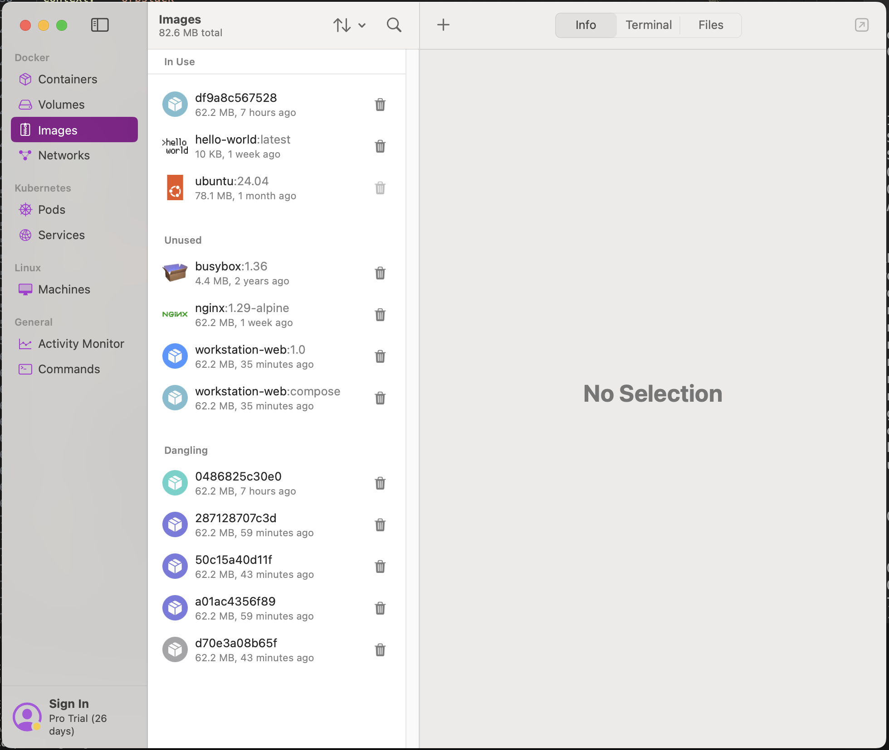

4. `docker ps`
현재 실행 중인 컨테이너 목록을 확인하는 명령이다. 출력이 비어 있으므로 조회 시점에는 실행 중인 컨테이너가 없었다.

5. `docker ps -a`
종료된 컨테이너까지 포함한 전체 목록을 확인하는 명령이다. 이번 출력에서는 `orbstack-web-lab` 처럼 이미 생성되었다가 종료된 컨테이너도 함께 조회된다.

6. `docker run --name hello-test hello-world`
가장 기본적인 Docker 동작 검증 명령이다. `Hello from Docker!` 문구가 출력되면, Docker 클라이언트가 데몬과 통신하고, 이미지를 실행해 컨테이너를 정상적으로 생성했다는 뜻이다. (이번 OrbStack 환경에서는 `hello-world` 이미지가 이미 로컬에 받아져 있던 상태로 확인되었다.)

7. `docker logs hello-test`
이미 실행이 끝난 `hello-test` 컨테이너의 로그를 다시 확인하는 명령이다. 여기서도 같은 `Hello from Docker!` 문구가 보이므로, 컨테이너 출력이 정상적으로 저장되었음을 확인할 수 있다.

## 5. 컨테이너 실행 실습

### 5-1. `ubuntu` 컨테이너로 `attach` / `exec` 차이를 직접 본다

```bash
$ docker run -dit --name ubuntu-lab ubuntu bash
6f421b9572730b68818aeeaa8ec2b201fb9108489cc236f62953cdd96f99a5fd

$ docker attach ubuntu-lab
root@6f421b957273:/# ls
bin   dev  home  lib64  mnt  proc  run   srv  tmp  var
boot  etc  lib   media  opt  root  sbin  sys  usr
root@6f421b957273:/# echo "attach mode" > /tmp/attach.txt
root@6f421b957273:/# cat /tmp/attach.txt
attach mode
root@6f421b957273:/# Ctrl + P, Ctrl + Q

$ docker exec -it ubuntu-lab bash
root@6f421b957273:/# cat /tmp/attach.txt
attach mode
root@6f421b957273:/# echo "exec mode" > /tmp/exec.txt
root@6f421b957273:/# cat /tmp/exec.txt
exec mode
root@6f421b957273:/# exit
exit

$ docker ps --filter name=ubuntu-lab
CONTAINER ID   IMAGE    COMMAND   CREATED              STATUS              PORTS     NAMES
6f421b957273   ubuntu   "bash"    Less than a minute   Up Less than a minute         ubuntu-lab

$ docker ps -a --filter name=ubuntu-lab
CONTAINER ID   IMAGE    COMMAND   CREATED              STATUS              PORTS     NAMES
6f421b957273   ubuntu   "bash"    Less than a minute   Up Less than a minute         ubuntu-lab
```

명령어 설명:

1. `docker run -dit --name ubuntu-lab ubuntu bash`
   `ubuntu` 이미지를 기반으로 `bash` 를 메인 프로세스로 실행하는 컨테이너를 만든다. `-d` 는 백그라운드 실행, `-i` 는 표준입력 유지, `-t` 는 터미널 할당을 의미한다. 출력으로 나온 긴 문자열은 새 컨테이너 ID 다.

   참고 이미지:

   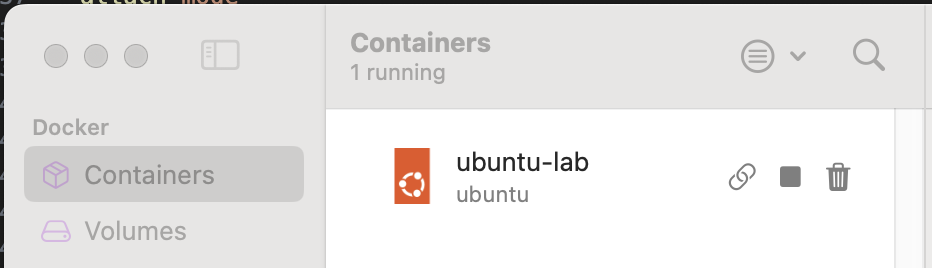

<p><strong>[attach]</strong></p>

2. `docker attach ubuntu-lab`
   이미 실행 중인 컨테이너의 메인 `bash` 프로세스에 직접 붙는다. 프롬프트가 `root@6f421b957273:/#` 로 바뀌는 것은 "호스트 셸" 이 아니라 "컨테이너 안의 셸" 로 들어갔다는 뜻이다.
3. `ls`
   컨테이너 루트 디렉터리의 기본 폴더 목록을 본다. `bin`, `etc`, `tmp`, `usr` 같은 표준 리눅스 디렉터리가 보이면 Ubuntu 컨테이너 내부 파일시스템을 보고 있다는 뜻이다.
4. `echo "attach mode" > /tmp/attach.txt` 와 `cat /tmp/attach.txt`
   `attach` 상태에서 파일을 직접 만들고, 곧바로 내용을 읽어 출력했다. `attach mode` 가 그대로 보이므로 컨테이너 안에서 파일 쓰기와 읽기가 정상 동작함을 확인할 수 있다.
5. `Ctrl + P`, `Ctrl + Q` (동시에 누르는 것이 아니라, `Ctrl + P` 다음 `Ctrl + Q` 를 순서대로 입력한다)
   `exit` 하지 않고 연결만 끊는 분리(detach) 키다. 이 방식으로 나오면 메인 `bash` 프로세스가 계속 살아 있으므로 컨테이너도 유지된다.
<br>
<p><strong>[exec]</strong></p>

6. `docker exec -it ubuntu-lab bash`
   이미 실행 중인 같은 컨테이너 안에서 "새로운 셸 프로세스" 를 추가로 띄운다. 즉, 메인 프로세스에 직접 붙는 `attach` 와 달리, `exec` 는 별도 작업 창을 하나 더 여는 개념이다.
7. `cat /tmp/attach.txt`
   앞서 `attach` 단계에서 만든 파일이 그대로 보인다. 출력이 `attach mode` 인 것은 두 작업이 같은 컨테이너 파일시스템을 공유한다는 뜻이다.
8. `echo "exec mode" > /tmp/exec.txt` 와 `cat /tmp/exec.txt`
   이번에는 `exec` 셸 안에서 새 파일을 만들고 읽었다. `exec mode` 출력으로 새 프로세스에서도 컨테이너 내부 작업이 가능함을 확인했다.
9. `exit`
   `exec` 로 연 셸만 종료한다. 메인 `bash` 는 아직 살아 있으므로 컨테이너 전체는 종료되지 않는다.
10. `docker ps`, `docker ps -a`
    두 명령 모두 `ubuntu-lab` 이 `Up` 상태로 보였다. 현재 실행 중인 컨테이너이기 때문에 `ps` 와 `ps -a` 양쪽에 모두 나타난다.

한 줄 정리:

- `attach`: 메인 프로세스에 직접 붙음
- `exec`: 실행 중인 컨테이너 안에서 새 프로세스를 띄움

### 5-2. OrbStack 추가 실습: `컨테이너 0개` 상태에서 새 컨테이너 만들기

```bash
$ docker ps -a
CONTAINER ID   IMAGE     COMMAND   CREATED   STATUS    PORTS     NAMES

$ docker create --name orbstack-web-lab -p 8092:80 workstation-web:1.0
a7411076a93ad802fa9d91276f301076c300fdab2677088ffd768db67ba10abd

$ docker ps -a --filter name=orbstack-web-lab
CONTAINER ID   IMAGE                 COMMAND                  STATUS    PORTS     NAMES
a7411076a93a   workstation-web:1.0   "/docker-entrypoint.…"   Created             orbstack-web-lab

$ docker start orbstack-web-lab
orbstack-web-lab

$ docker ps --filter name=orbstack-web-lab
CONTAINER ID   IMAGE                 STATUS                  PORTS                                     NAMES
a7411076a93a   workstation-web:1.0   Up Less than a second   0.0.0.0:8092->80/tcp, [::]:8092->80/tcp   orbstack-web-lab

$ curl -s http://localhost:8092 | grep -o "<title>AI/SW 개발 워크스테이션 구축</title>"
<title>AI/SW 개발 워크스테이션 구축</title>

$ docker stop orbstack-web-lab
orbstack-web-lab
```

명령어 설명:

1. `docker ps -a`
   종료된 컨테이너까지 포함한 전체 목록을 확인하는 명령이다. 출력이 비어 있으므로, 이 시점에는 OrbStack `Containers` 탭 기준으로도 생성된 컨테이너가 없었다는 뜻이다.

2. `docker create --name orbstack-web-lab -p 8092:80 workstation-web:1.0`
   `workstation-web:1.0` 이미지를 바탕으로 새 컨테이너를 만든다. 여기서 `--name` 은 컨테이너 이름, `-p 8092:80` 은 호스트 8092 포트를 컨테이너 80 포트에 연결하는 설정이다. 출력으로 나온 긴 문자열은 새 컨테이너 ID 다.

3. `docker ps -a --filter name=orbstack-web-lab`
   방금 만든 컨테이너만 필터링해서 다시 확인한다. 상태가 `Created` 로 보이므로, 컨테이너 객체는 만들어졌지만 아직 실행 전이라는 뜻이다.

4. `docker start orbstack-web-lab`
   `Created` 상태의 컨테이너를 실제로 실행한다. 출력이 컨테이너 이름 `orbstack-web-lab` 로 나오면 시작 명령이 정상 처리된 것이다.

5. `docker ps --filter name=orbstack-web-lab`
   현재 실행 중인 컨테이너만 확인한다. 출력에 `Up` 이 보이고 `0.0.0.0:8092->80/tcp` 포트 매핑이 함께 보이므로, 컨테이너가 실행 중이며 호스트 8092 포트로 접근할 수 있다는 뜻이다.

6. `curl -s http://localhost:8092 | grep -o "<title>AI/SW 개발 워크스테이션 구축</title>"`
   브라우저 대신 터미널에서 웹 응답을 검증하는 명령이다. 출력으로 `<title>AI/SW 개발 워크스테이션 구축</title>` 가 보이면, `orbstack-web-lab` 컨테이너의 NGINX 페이지가 정상 응답하고 있다는 뜻이다.

7. `docker stop orbstack-web-lab`
   실행 중인 컨테이너를 정지한다. 이 명령은 컨테이너를 삭제하지 않고 실행만 멈추므로, 이후 다시 `docker ps -a` 를 보면 `Exited` 상태로 남아 있는 것을 확인할 수 있다.

참고 이미지:

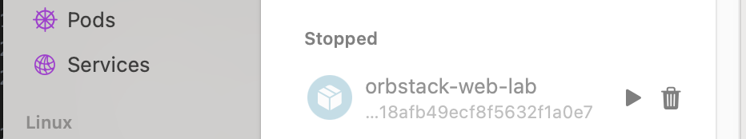

## 6. 웹 서버 소스 작성, Dockerfile 작성, 이미지 빌드, 포트 매핑 실행

`Dockerfile`:

```dockerfile
FROM nginx:alpine
LABEL org.opencontainers.image.title="my-custom-nginx"
ENV APP_ENV=dev
COPY web/ /usr/share/nginx/html/
EXPOSE 80
```

Dockerfile 설명:

1. `FROM nginx:alpine`
   `nginx:alpine` 이미지를 베이스로 사용한다. 입력은 "가벼운 NGINX 웹 서버 이미지를 기반으로 삼겠다"는 뜻이고, 결과적으로 직접 웹 서버를 처음부터 설치하지 않아도 정적 페이지를 빠르게 띄울 수 있다.
2. `LABEL org.opencontainers.image.title="my-custom-nginx"`
   이미지에 식별용 메타데이터를 붙인다. 입력은 이미지 제목 정보이고, 출력은 터미널에 직접 보이지 않더라도 이미지 관리 도구에서 어떤 용도의 이미지인지 구분하는 데 도움이 된다.
3. `ENV APP_ENV=dev`
   컨테이너 내부 기본 환경변수를 설정한다. 입력은 `APP_ENV` 값을 `dev` 로 두겠다는 뜻이고, 이 값은 이후 컨테이너 안에서 설정값처럼 읽어 쓸 수 있다.
4. `COPY web/ /usr/share/nginx/html/`
   호스트의 `web/` 디렉터리 내용을 NGINX 기본 웹 루트로 복사한다. 입력은 우리가 만든 웹 파일들이고, 출력은 컨테이너가 실행될 때 그 파일을 바로 서비스할 수 있는 상태가 된다.
5. `EXPOSE 80`
   컨테이너가 기본적으로 사용하는 웹 포트가 `80` 임을 문서처럼 명시한다. 입력은 포트 번호 선언이고, 실제 외부 접속은 이후 `docker run -p 8088:80 ...` 처럼 포트 매핑했을 때 가능해진다.

명령줄 실행:

```bash
$ mkdir -p web

$ echo '<h1>Hello Web Server</h1>' > web/index.html

$ docker build -t workstation-web:1.0 .
...
#7 naming to docker.io/library/workstation-web:1.0

$ docker images
REPOSITORY        TAG           IMAGE ID       CREATED          SIZE
workstation-web   1.0           032726192584   1 second ago     62.2MB
<none>            <none>        a83ff33665b4   6 minutes ago    62.2MB

$ docker run -d --name mission-web -p 8088:80 workstation-web:1.0
c41532c375912a4c75783ad29588883b49ca0be4faa405b7af8e808b7a2fed42

$ docker ps
CONTAINER ID   IMAGE                 COMMAND                  CREATED                  STATUS                  PORTS                                     NAMES
c41532c37591   workstation-web:1.0   "/docker-entrypoint.…"   Less than a second ago   Up Less than a second   0.0.0.0:8088->80/tcp, [::]:8088->80/tcp   mission-web

$ docker logs mission-web | sed -n '1,8p'
/docker-entrypoint.sh: /docker-entrypoint.d/ is not empty, will attempt to perform configuration
/docker-entrypoint.sh: Looking for shell scripts in /docker-entrypoint.d/
/docker-entrypoint.sh: Launching /docker-entrypoint.d/10-listen-on-ipv6-by-default.sh
10-listen-on-ipv6-by-default.sh: info: Getting the checksum of /etc/nginx/conf.d/default.conf
10-listen-on-ipv6-by-default.sh: info: Enabled listen on IPv6 in /etc/nginx/conf.d/default.conf
/docker-entrypoint.sh: Sourcing /docker-entrypoint.d/15-local-resolvers.envsh
/docker-entrypoint.sh: Launching /docker-entrypoint.d/20-envsubst-on-templates.sh
/docker-entrypoint.sh: Launching /docker-entrypoint.d/30-tune-worker-processes.sh

$ curl -s http://localhost:8088 | grep -o "<h1>Hello Web Server</h1>"
<h1>Hello Web Server</h1>
```

명령줄 설명:

1. `mkdir -p web`
   웹 소스 폴더를 만드는 입력이다. 출력은 따로 없지만, 이후 `web/index.html` 파일을 안전하게 만들 수 있는 디렉터리가 준비된다.
2. `echo '<h1>Hello Web Server</h1>' > web/index.html`
   가장 단순한 HTML 본문을 파일로 저장하는 입력이다. 출력은 따로 없고, 결과로 `web/index.html` 안에 `Hello Web Server` 문구가 들어간다.
3. `docker build -t workstation-web:1.0 .`
   현재 디렉터리의 `Dockerfile` 과 build context를 사용해 이미지를 만드는 입력이다. 출력 중 `naming to docker.io/library/workstation-web:1.0` 가 보이면 `workstation-web:1.0` 이름의 이미지가 정상 생성되었다는 뜻이다.
4. `docker images`
   로컬 이미지 목록을 확인하는 입력이다. 출력에서 `workstation-web   1.0` 이 보이므로 방금 빌드한 커스텀 이미지가 실제로 저장되었음을 확인할 수 있다.
5. `docker run -d --name mission-web -p 8088:80 workstation-web:1.0`
   방금 만든 이미지를 백그라운드 컨테이너로 실행하는 입력이다. 출력으로 긴 컨테이너 ID 가 나오면 생성과 시작이 정상 처리된 것이다. `-p 8088:80` 은 호스트 8088 포트를 컨테이너 80 포트에 연결한다는 의미다.
6. `docker ps`
   현재 실행 중인 컨테이너를 확인하는 입력이다. 출력에서 `mission-web` 이 `Up` 상태로 보이고 `0.0.0.0:8088->80/tcp` 가 함께 보이므로, 컨테이너가 실행 중이며 브라우저에서 `localhost:8088` 로 접근할 수 있음을 뜻한다.
7. `docker logs mission-web | sed -n '1,8p'`
   컨테이너 시작 로그 일부를 확인하는 입력이다. 출력에 `/docker-entrypoint.sh` 와 NGINX 초기화 관련 문장이 보이므로, NGINX가 정상적으로 기동 과정을 수행했음을 확인할 수 있다.
8. `curl -s http://localhost:8088 | grep -o "<h1>Hello Web Server</h1>"`
   브라우저 대신 터미널에서 HTTP 응답을 검증하는 입력이다. 출력으로 `<h1>Hello Web Server</h1>` 가 그대로 보였기 때문에, 포트 매핑된 웹 서버가 우리가 만든 페이지를 정상 응답하고 있다는 뜻이다.

브라우저 접속 증거:

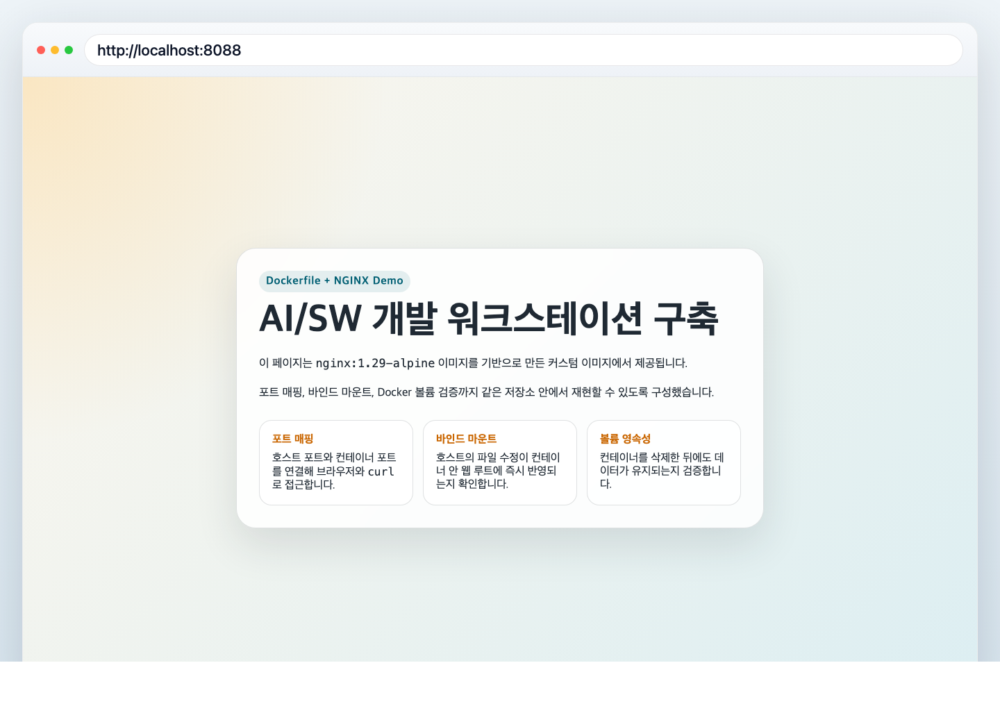

## 7. 바인드 마운트 반영 검증

```bash
$ mkdir -p bind-site

$ echo '<h1>Bind Mount Version 1</h1>' > bind-site/index.html

$ docker run -d --name bind-web -p 8081:80 -v "$(pwd)/bind-site:/usr/share/nginx/html" nginx:alpine
1f6c5574cdf60048ce3a7448190555fa3fa2a5d810fcf229f8beb37c4f65fee1

$ curl -s http://localhost:8081
<!DOCTYPE html>
<html lang="ko">
<head>
  <meta charset="UTF-8">
  <title>Bind Mount Version 1</title>
</head>
<body>
  <h1>Bind Mount Version 1</h1>
</body>
</html>

$ echo '<h1>Bind Mount Version 2</h1>' > bind-site/index.html

$ curl -s http://localhost:8081
<!DOCTYPE html>
<html lang="ko">
<head>
  <meta charset="UTF-8">
  <title>Bind Mount Version 2</title>
</head>
<body>
  <h1>Bind Mount Version 2</h1>
</body>
</html>
```

명령줄 설명:

1. `mkdir -p bind-site`
   바인드 마운트 실험용 디렉터리를 호스트에 만드는 명령이다. 이 폴더가 이후 컨테이너의 `/usr/share/nginx/html` 과 직접 연결된다.

2. `echo '<h1>Bind Mount Version 1</h1>' > bind-site/index.html`
   호스트 쪽 HTML 파일의 첫 번째 버전을 만든다. 이 파일은 이미지에 복사되는 것이 아니라, 컨테이너 실행 시 실시간으로 연결될 원본 파일이다.

3. `docker run -d --name bind-web -p 8081:80 -v "$(pwd)/bind-site:/usr/share/nginx/html" nginx:alpine`
   `nginx:alpine` 컨테이너를 실행하면서 호스트의 `bind-site` 디렉터리를 컨테이너 웹 루트에 바인드 마운트하는 명령이다. `-v` 옵션 때문에 컨테이너는 자기 내부 파일 대신 호스트 디렉터리 내용을 바로 읽게 된다.

4. `curl -s http://localhost:8081`
   수정 전 웹 응답을 확인하는 명령이다. 출력에 `Bind Mount Version 1` 이 보이므로, 호스트 파일의 첫 번째 버전이 컨테이너 웹 서버를 통해 정상 제공되고 있다는 뜻이다.

5. `echo '<h1>Bind Mount Version 2</h1>' > bind-site/index.html`
   이번에는 이미 실행 중인 컨테이너를 건드리지 않고, 호스트 파일만 두 번째 버전으로 덮어쓴다. 이 단계가 바인드 마운트 검증의 핵심이다.

6. `curl -s http://localhost:8081`
   수정 후 웹 응답을 다시 확인하는 명령이다. 출력이 바로 `Bind Mount Version 2` 로 바뀌었으므로, 이미지를 다시 빌드하거나 컨테이너를 다시 만들지 않아도 호스트 변경 사항이 즉시 반영된다는 것을 확인할 수 있다.

의미 정리:

- 바인드 마운트는 호스트 디렉터리와 컨테이너 경로를 직접 연결한다.
- 그래서 호스트 파일을 수정하면 이미 실행 중인 컨테이너도 새 파일 내용을 즉시 읽는다.
- 개발 중 "코드를 고치고 바로 반영 보기" 에 특히 유용하다.

브라우저 접속 증거:

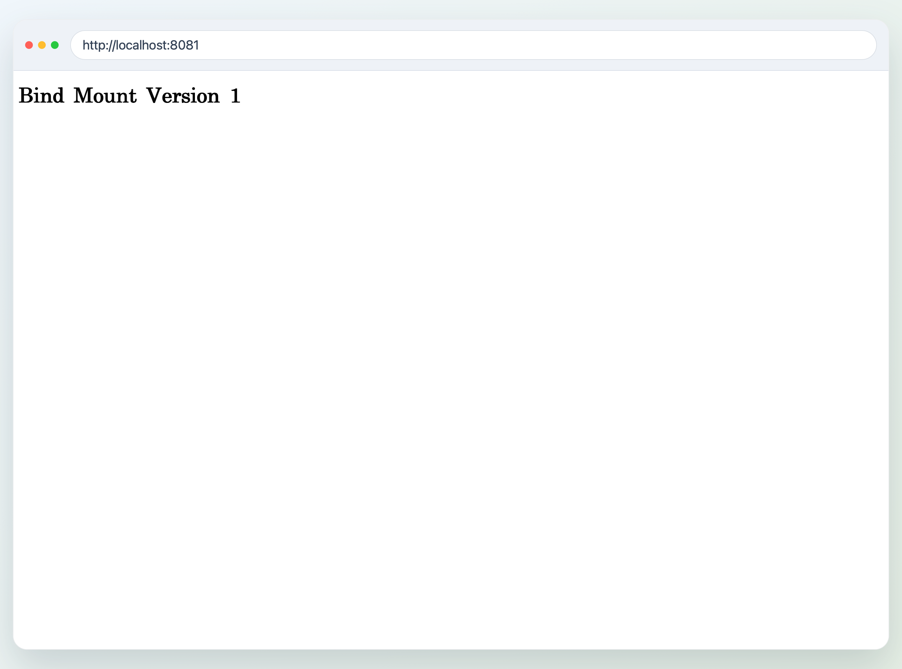

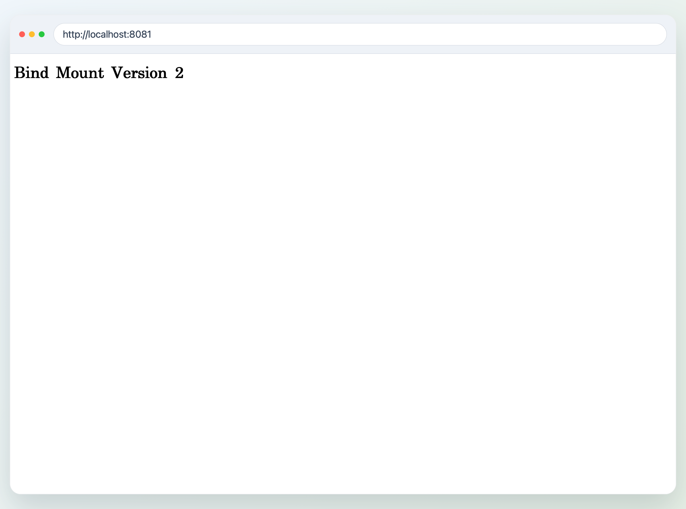

## 8. Docker 볼륨 영속성 검증

생성 명령:

```bash
$ docker volume create mydata
mydata

$ docker volume ls
DRIVER    VOLUME NAME
local     mydata
```

첫 컨테이너에서 파일 생성:

```bash
$ docker run -d --name vol-test -v mydata:/data ubuntu sleep infinity
8ea9a5b79f9d14ff244563989239175e80a4d3c4d556f994ba7aa280d309ed06

$ docker exec -it vol-test bash -lc 'echo hi > /data/hello.txt && cat /data/hello.txt'
hi
```

컨테이너 삭제:

```bash
$ docker rm -f vol-test
vol-test
```

새 컨테이너에서 같은 파일 확인:

```bash
$ docker run -d --name vol-test2 -v mydata:/data ubuntu sleep infinity
92a168ef588aaf3ae23ccf4f81e4089837f07ccf267a5324616c8e127dec1c6f

$ docker exec -it vol-test2 bash -lc 'cat /data/hello.txt'
hi
```

의미 정리:

- `docker volume create mydata` 는 컨테이너 밖에 남는 별도 저장공간을 만든다.
- 첫 번째 컨테이너 `vol-test` 안에서 `/data/hello.txt` 를 만들고 `hi` 를 저장했다.
- `docker rm -f vol-test` 로 첫 컨테이너를 삭제했지만, 볼륨 `mydata` 자체는 삭제되지 않는다.
- 두 번째 컨테이너 `vol-test2` 를 같은 볼륨에 다시 연결했을 때도 `cat /data/hello.txt` 결과가 `hi` 로 그대로 보였으므로, 데이터가 컨테이너가 아니라 볼륨에 남아 있었다는 것을 확인할 수 있다.

Mermaid 다이어그램:

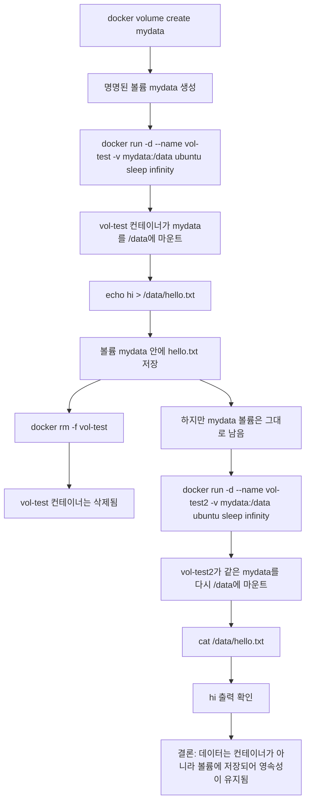

## 9. 운영 명령 검증

```bash
$ docker images
REPOSITORY        TAG           IMAGE ID       SIZE
workstation-web   1.0           032726192584   62.2MB
workstation-web   compose       0a44ae70aadc   62.2MB
nginx             1.29-alpine   d5030d429039   62.2MB
nginx             alpine        d5030d429039   62.2MB
hello-world       latest        e2ac70e7319a   10.1kB
ubuntu            24.04         f794f40ddfff   78.1MB
busybox           1.36          b116e1550744   4.42MB

$ docker ps -a
CONTAINER ID   IMAGE                 STATUS                   PORTS                                     NAMES
92a168ef588a   ubuntu                Up ...                                                             vol-test2
c41532c37591   workstation-web:1.0   Up ...                  0.0.0.0:8088->80/tcp, [::]:8088->80/tcp   mission-web
1f6c5574cdf6   nginx:alpine          Up ...                  0.0.0.0:8081->80/tcp, [::]:8081->80/tcp   bind-web
c2b38a808a53   nginx:1.29-alpine     Up ...                  0.0.0.0:8089->80/tcp, [::]:8089->80/tcp   mission-bind
6f421b957273   ubuntu                Up ...                                                             ubuntu-lab
a7411076a93a   df9a8c567528          Exited ...                                                        orbstack-web-lab

$ docker logs mission-web | tail -n 5
/docker-entrypoint.sh: Sourcing /docker-entrypoint.d/15-local-resolvers.envsh
/docker-entrypoint.sh: Launching /docker-entrypoint.d/20-envsubst-on-templates.sh
/docker-entrypoint.sh: Launching /docker-entrypoint.d/30-tune-worker-processes.sh
/docker-entrypoint.sh: Configuration complete; ready for start up
192.168.215.1 - - [02/Apr/2026:19:41:44 +0000] "GET / HTTP/1.1" 200 26 "-" "curl/8.7.1" "-"

$ docker stats --no-stream mission-web
CONTAINER ID   NAME          CPU %     MEM USAGE / LIMIT     MEM %     NET I/O         BLOCK I/O         PIDS
c41532c37591   mission-web   0.00%     4.945MiB / 15.67GiB   0.03%     1.84kB / 810B   10.2MB / 8.19kB   7
```

의미 정리:

- `docker images` 로 지금까지 실습에 사용한 커스텀 이미지, 베이스 이미지, 보너스용 이미지가 로컬에 남아 있는지 다시 확인했다.
- `docker ps -a` 로 웹 서버, 바인드 마운트, 볼륨 실습, Ubuntu 실습, OrbStack 추가 실습 컨테이너까지 현재 상태를 한 번에 점검했다.
- `docker logs mission-web | tail -n 5` 로 NGINX 초기화와 실제 HTTP 요청 로그를 확인해 웹 서버가 정상 응답하고 있음을 검증했다.
- `docker stats --no-stream mission-web` 로 CPU, 메모리, 네트워크 I/O, 블록 I/O 를 한 번성으로 확인해 실행 중 컨테이너의 리소스 상태를 점검했다.

참고 이미지:

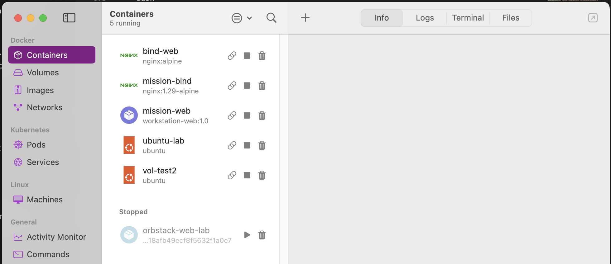

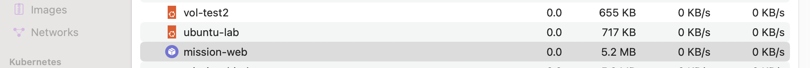

## 10. Git / GitHub / VSCode 연동

명령줄 실행:

```bash
$ git config --global user.name "request10hour"

$ git config --global user.email "request10hour@gmail.com"

$ git config --global init.defaultBranch main

$ code .

# VSCode 안에서 GitHub 로그인 진행
# VSCode 안에서 현재 저장소 열기 및 Source Control 연동 확인
```

VSCode 로그인 증거:

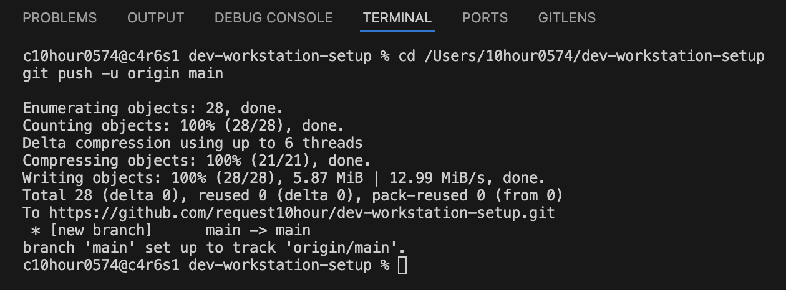

Github 연동 증거:

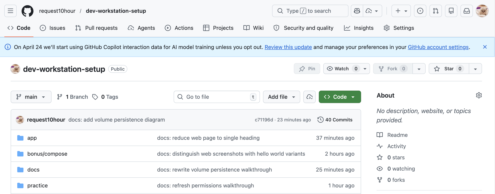

## 11. 트러블슈팅

### 11-1. `docker images` 출력에 `<none>` 이미지가 많이 남아 현재 상태 판단이 복잡해짐

- 문제:
  `docker build` 를 여러 번 반복하면서 `docker images` 출력에 `<none>` 태그 이미지들이 많이 쌓였다. 이 상태에서는 지금 실제로 사용하는 이미지가 무엇인지 한눈에 구분하기 어려웠고, 운영 명령 검증 섹션에 어떤 이미지를 기준으로 적어야 할지도 헷갈렸다.
- 원인 가설:
  이미지를 다시 빌드할 때마다 이전 빌드 결과 일부가 태그를 잃은 상태로 남아 dangling image 가 되었을 가능성이 있었다. 즉 Docker 엔진 자체의 오류라기보다, 반복 빌드 과정에서 정리되지 않은 이미지 레이어가 누적된 상황이라고 판단했다.
- 확인:
  `docker images` 를 다시 확인해 보니 `workstation-web:1.0`, `workstation-web:compose`, `nginx:alpine`, `hello-world`, `ubuntu` 같은 실제 사용 이미지 외에 `<none>` 으로 표시되는 항목이 여러 개 보였다. 이 때문에 현재 과제에서 진짜로 쓰는 이미지와 과거 빌드 흔적이 한 화면에 섞여 있었다.
- 해결:
  1. 먼저 `docker ps -a` 와 `docker images` 로 지금 실제로 사용 중인 컨테이너와 이미지가 무엇인지 구분했다.
  2. 그 다음 `<none>` 이미지들이 "현재 실행 중인 이미지" 가 아니라, 이전 빌드에서 남은 dangling image 라는 점을 기준으로 정리 대상을 판단했다.
  3. 문서에는 실제 과제 흐름에 필요한 태그 이미지들만 남겨 읽기 쉽게 정리하고, 운영 명령 검증 섹션에서는 `workstation-web:1.0`, `nginx:alpine`, `hello-world`, `ubuntu`, `busybox` 처럼 의미 있는 이미지 위주로 다시 기술했다.
  4. 필요하면 실무적으로는 `docker images -f "dangling=true"` 로 태그 없는 이미지들만 확인한 뒤 `docker image prune -f` 로 정리할 수 있다는 기준도 함께 정리했다.
- 배운 점:
  `<none>` 이미지는 대개 Docker가 고장났다는 뜻이 아니라, 반복 빌드 뒤에 남은 중간 이미지나 태그를 잃은 이미지인 경우가 많다. 따라서 무조건 다 지우기보다, 먼저 현재 사용하는 이미지와 컨테이너를 확인한 뒤 dangling image 만 골라 정리하는 것이 안전하다.

### 11-2. `git push` 시 GitHub 인증이 없어 업로드가 실패함

- 문제:
  `git push -u origin main` 실행 시 `fatal: could not read Username for 'https://github.com': Device not configured` 오류가 발생했다. 저장소와 브랜치는 준비되어 있었지만 원격 업로드가 되지 않았다.
- 원인 가설:
  원격 저장소 주소는 이미 연결되어 있었지만, 현재 macOS 세션에서 HTTPS 원격 저장소에 사용할 GitHub 인증 정보가 없어서 push 단계에서 인증이 막혔을 가능성이 있었다.
- 확인:
  `git remote -v` 로 원격 주소가 `https://github.com/request10hour/dev-workstation-setup.git` 형식임을 확인했다. 또 `git config --list --show-origin` 에서는 `credential.helper=osxkeychain` 이 설정되어 있었지만, 실제 push 시 사용할 로그인 정보가 아직 저장되지 않았음을 알 수 있었다. 이후 VSCode에서 GitHub 로그인과 저장소 연동을 완료한 뒤 다시 push 했을 때는 정상적으로 업로드가 성공했다.
- 해결:
  1. `code .` 로 현재 저장소를 VSCode에서 열었다.
  2. VSCode 안에서 GitHub 로그인 흐름을 따라 계정 인증을 완료했다.
  3. Source Control 화면에서 현재 저장소와 GitHub 계정 연동 상태를 확인했다.
  4. 터미널로 돌아와 `git push -u origin main` 을 다시 실행해 원격 저장소에 업로드했다.
  5. 마지막으로 `curl -s https://api.github.com/repos/request10hour/dev-workstation-setup | rg '"private"|"visibility"|"default_branch"'` 명령으로 저장소가 `public` 이고 기본 브랜치가 `main` 인지 재확인했다.
- 배운 점:
  원격 저장소 주소가 연결되어 있다고 해서 인증까지 끝난 것은 아니다. 특히 HTTPS 방식은 GitHub 로그인 또는 토큰 저장이 완료되어야 push 가 가능하다. 이후 같은 문제가 반복되면 SSH 키를 등록해 `git@github.com:...` 형식으로 바꾸는 것도 좋은 대안이다.
