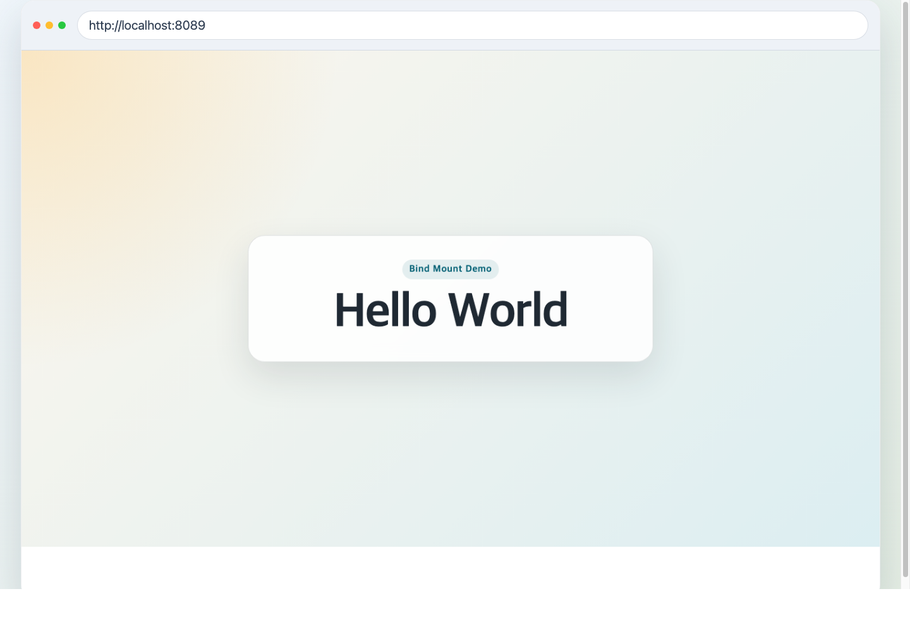
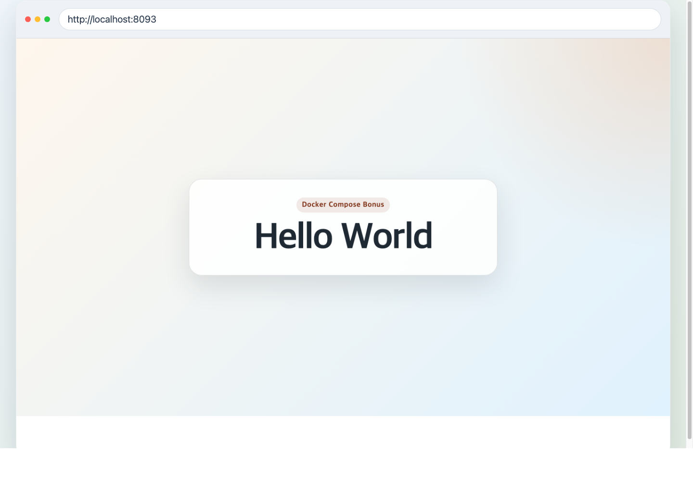

# AI/SW 개발 워크스테이션 구축

## 1. 실행 환경

```bash
$ pwd
/Users/10hour0574/dev-workstation-setup

$ uname -a
Darwin c4r6s1.codyssey.kr 24.6.0 Darwin Kernel Version 24.6.0: Mon Jan 19 22:00:10 PST 2026; root:xnu-11417.140.69.708.3~1/RELEASE_X86_64 x86_64

$ echo $SHELL
/bin/zsh

$ docker --version
Docker version 28.5.2, build ecc6942

$ docker info
WARNING: DOCKER_INSECURE_NO_IPTABLES_RAW is set
Client:
 Version:    28.5.2
 Context:    orbstack
 Debug Mode: true
 Plugins:
  buildx: Docker Buildx (Docker Inc.)
    Version:  v0.29.1
  compose: Docker Compose (Docker Inc.)
    Version:  v2.40.3

Server:
 Containers: 1
  Running: 0
  Paused: 0
  Stopped: 1
 Images: 12
 Server Version: 28.5.2
 Storage Driver: overlay2

$ git --version
git version 2.53.0
```

명령어 설명:

1. `pwd`
`pwd` 는 현재 작업 중인 디렉터리의 절대 경로를 출력하는 명령이다. 여기서 나온 `/Users/10hour0574/dev-workstation-setup` 는 내가 이 과제를 수행한 저장소 루트 위치를 의미한다.

2. `uname -a`
`uname -a` 는 현재 시스템의 커널과 아키텍처 정보를 한 줄로 보여 주는 명령이다. 출력 결과의 `Darwin` 은 macOS 계열 커널임을 뜻하고, 마지막의 `x86_64` 는 이 환경이 64비트 Intel 아키텍처 기준으로 동작하고 있음을 의미한다.

3. `echo $SHELL`
`echo $SHELL` 은 현재 사용자가 기본으로 사용하는 셸 프로그램 경로를 확인하는 명령이다. 출력값 `/bin/zsh` 는 이 과제에서 사용한 기본 셸이 `zsh` 라는 뜻이다.

4. `docker --version`
`docker --version` 은 Docker CLI 가 설치되어 있는지와 버전이 무엇인지 확인하는 명령이다. 출력값 `Docker version 28.5.2, build ecc6942` 는 Docker 명령어가 정상 설치되어 있고, 현재 사용한 버전이 `28.5.2` 임을 의미한다.

5. `docker info`
`docker info` 는 Docker CLI 자체가 아니라 실제 Docker 엔진이 동작 중인지, 어떤 컨텍스트와 스토리지 드라이버를 사용하는지까지 보여 주는 점검 명령이다. 이번 출력에서 `Context: orbstack` 은 OrbStack 환경에 연결되어 있음을 뜻하고, `Server Version: 28.5.2` 는 Docker 데몬이 실제로 동작 중임을 의미한다. 또한 `Containers: 1`, `Images: 12` 는 조회 시점 기준으로 엔진 안에 컨테이너와 이미지가 각각 몇 개 있었는지를 보여 준다.

6. `git --version`
`git --version` 은 Git 이 설치되어 있는지와 버전을 확인하는 명령이다. 출력값 `git version 2.53.0` 은 이 과제에서 사용한 Git 버전이 `2.53.0` 임을 의미한다.

재현성 주의사항:

- 이 저장소에서 사용한 실제 경로는 `/Users/10hour0574/dev-workstation-setup` 이다.
- 다른 PC에서는 같은 저장소를 clone 한 뒤 자신의 작업 경로로 바꿔 읽으면 된다.
- 경로를 문서화할 때는 절대 경로 예시와 함께 `$PWD`, 상대 경로를 병기하면 재현성이 좋아진다.

## 2. 터미널 기본 조작

```bash
$ cd /Users/10hour0574/dev-workstation-setup/practice

$ pwd
/Users/10hour0574/dev-workstation-setup/practice

$ ls -la
total 0
drwxr-xr-x   4 c10hour0574  c10hour0574  128 Apr  3 03:01 .
drwxr-xr-x  11 c10hour0574  c10hour0574  352 Apr  3 02:31 ..
drwxr-xr-x   4 c10hour0574  c10hour0574  128 Apr  2 19:39 permissions
drwxr-xr-x   4 c10hour0574  c10hour0574  128 Apr  2 19:39 terminal

$ mkdir cli-lab

$ cd cli-lab

$ pwd
/Users/10hour0574/dev-workstation-setup/practice/cli-lab

$ ls -la
total 0
drwxr-xr-x  2 c10hour0574  c10hour0574   64 Apr  3 03:16 .
drwxr-xr-x  5 c10hour0574  c10hour0574  160 Apr  3 03:16 ..

$ touch empty.txt

$ echo "hello terminal" > memo.txt

$ cat memo.txt
hello terminal

$ cp memo.txt copy.txt

$ mv copy.txt renamed.txt

$ mkdir dir1

$ mv renamed.txt dir1/

$ cp -r dir1 dir1_backup

$ ls -la
total 8
drwxr-xr-x  6 c10hour0574  c10hour0574  192 Apr  3 03:16 .
drwxr-xr-x  5 c10hour0574  c10hour0574  160 Apr  3 03:16 ..
drwxr-xr-x  3 c10hour0574  c10hour0574   96 Apr  3 03:16 dir1
drwxr-xr-x  3 c10hour0574  c10hour0574   96 Apr  3 03:16 dir1_backup
-rw-r--r--  1 c10hour0574  c10hour0574    0 Apr  3 03:16 empty.txt
-rw-r--r--  1 c10hour0574  c10hour0574   15 Apr  3 03:16 memo.txt

$ rm empty.txt

$ rm -rf dir1_backup

$ ls -la
total 8
drwxr-xr-x  4 c10hour0574  c10hour0574  128 Apr  3 03:16 .
drwxr-xr-x  5 c10hour0574  c10hour0574  160 Apr  3 03:16 ..
drwxr-xr-x  3 c10hour0574  c10hour0574   96 Apr  3 03:16 dir1
-rw-r--r--  1 c10hour0574  c10hour0574   15 Apr  3 03:16 memo.txt
```

명령어 설명:

1. `cd /Users/10hour0574/dev-workstation-setup/practice`
실습 시작 위치를 `practice` 디렉터리로 맞추는 명령이다. 이렇게 하면 서비스 파일과 실습 파일이 섞이지 않고, 과제용 조작 흔적을 별도 공간에 남길 수 있다.

2. `pwd`, `ls -la`
`pwd` 는 현재 위치를 절대 경로로 확인하는 명령이고, `ls -la` 는 숨김 파일까지 포함한 현재 디렉터리 목록을 보여 주는 명령이다. 실습 전후에 이 두 명령을 같이 쓰면 "지금 어디서 무엇을 보고 있는지" 를 명확히 기록할 수 있다.

3. `mkdir cli-lab`, `cd cli-lab`
새 실습 폴더를 만들고 그 안으로 들어가는 과정이다. 이번 실습용 작업 디렉터리는 `/Users/10hour0574/dev-workstation-setup/practice/cli-lab` 이다.

4. `touch empty.txt`, `echo "hello terminal" > memo.txt`, `cat memo.txt`
`touch` 는 빈 파일을 만들고, `echo ... > 파일명` 은 문자열을 파일에 저장한다. `cat memo.txt` 결과로 `hello terminal` 이 출력되었기 때문에 파일이 정상 생성되고 내용도 올바르게 들어갔음을 확인할 수 있다.

5. `cp`, `mv`
`cp memo.txt copy.txt` 는 파일 복사, `mv copy.txt renamed.txt` 는 파일 이름 변경이다. 이후 `mv renamed.txt dir1/` 는 파일 이동까지 수행한다. 즉 `mv` 는 이름 변경과 이동을 모두 담당하는 명령이다.

6. `mkdir dir1`, `cp -r dir1 dir1_backup`
`mkdir dir1` 은 디렉터리 생성이고, `cp -r` 는 디렉터리를 하위 파일까지 포함해 재귀적으로 복사하는 명령이다. 그래서 `dir1` 과 `dir1_backup` 이 동시에 생성된다.

7. `rm empty.txt`, `rm -rf dir1_backup`
`rm` 은 파일 삭제, `rm -rf` 는 디렉터리와 그 하위 내용을 강제로 함께 삭제할 때 사용한다. 마지막 `ls -la` 결과에서 `empty.txt` 와 `dir1_backup` 이 사라지고 `memo.txt`, `dir1/renamed.txt` 만 남아 있는 것을 확인할 수 있다.

절대 경로와 상대 경로 설명:

- 절대 경로는 루트(`/`)부터 전체 위치를 적는 방식이다. 이번 실습 디렉터리의 절대 경로 예시는 `/Users/10hour0574/dev-workstation-setup/practice/cli-lab` 이다.
- 상대 경로는 현재 위치를 기준으로 적는 방식이다. `cli-lab` 안에서 저장소의 웹 페이지 파일을 가리키는 상대 경로 예시는 `../../app/index.html` 이다.
- 문서에 절대 경로와 상대 경로를 함께 적어 두면, 평가자가 현재 위치를 다르게 잡더라도 작업 과정을 더 쉽게 재현할 수 있다.

전체 로그:
- [terminal-basics.txt](docs/logs/terminal-basics.txt)

## 3. 권한 실습

```bash
$ cd /Users/10hour0574/dev-workstation-setup/practice

$ touch perm_file.txt

$ mkdir perm_dir

$ ls -l perm_file.txt
-rw-r--r--  1 c10hour0574  c10hour0574  0 Apr  3 03:18 perm_file.txt

$ ls -ld perm_dir
drwxr-xr-x  2 c10hour0574  c10hour0574  64 Apr  3 03:18 perm_dir

$ chmod 600 perm_file.txt

$ chmod 700 perm_dir

$ ls -l perm_file.txt
-rw-------  1 c10hour0574  c10hour0574  0 Apr  3 03:18 perm_file.txt

$ ls -ld perm_dir
drwx------  2 c10hour0574  c10hour0574  64 Apr  3 03:18 perm_dir

$ chmod 644 perm_file.txt

$ chmod 755 perm_dir

$ ls -l perm_file.txt
-rw-r--r--  1 c10hour0574  c10hour0574  0 Apr  3 03:18 perm_file.txt

$ ls -ld perm_dir
drwxr-xr-x  2 c10hour0574  c10hour0574  64 Apr  3 03:18 perm_dir
```

명령어 설명:

1. `touch perm_file.txt`, `mkdir perm_dir`
파일 1개와 디렉터리 1개를 만들어 권한 실습 대상물을 준비하는 단계다. 이번 실습에서는 `perm_file.txt` 와 `perm_dir` 를 같은 위치에서 비교했다.

2. `ls -l perm_file.txt`, `ls -ld perm_dir`
권한 변경 전 상태를 확인하는 명령이다. 일반 파일은 `-rw-r--r--`, 디렉터리는 `drwxr-xr-x` 로 시작하는데, 맨 앞 문자는 각각 파일(`-`)과 디렉터리(`d`) 타입을 의미한다.

3. `chmod 600 perm_file.txt`, `chmod 700 perm_dir`
파일은 소유자만 읽기/쓰기 가능하도록 `600` 으로 바꾸고, 디렉터리는 소유자만 읽기/쓰기/진입 가능하도록 `700` 으로 바꾼다. 이후 `ls` 결과에서 파일은 `-rw-------`, 디렉터리는 `drwx------` 로 바뀐 것을 확인할 수 있다.

4. `chmod 644 perm_file.txt`, `chmod 755 perm_dir`
마지막으로 파일은 일반적인 읽기 중심 권한인 `644`, 디렉터리는 읽기/진입이 가능한 `755` 로 되돌린다. 변경 후 결과는 각각 `-rw-r--r--`, `drwxr-xr-x` 이다.

권한 숫자 해석:

- `r` 는 읽기, `w` 는 쓰기, `x` 는 실행 또는 디렉터리 진입 권한이다.
- `r = 4`, `w = 2`, `x = 1`
- 세 자리 숫자는 `소유자/그룹/기타 사용자` 순서다.
- `644 = rw- r-- r--`
- `755 = rwx r-x r-x`
- `644` 는 소유자는 읽기/쓰기, 그룹과 기타 사용자는 읽기만 가능하다는 뜻이다.
- `755` 는 소유자는 읽기/쓰기/진입이 가능하고, 그룹과 기타 사용자는 읽기와 진입만 가능하다는 뜻이다.

전체 로그:
- [permissions.txt](docs/logs/permissions.txt)

## 4. Docker 설치 및 기본 점검

```bash
$ docker --version
Docker version 28.5.2, build ecc6942

$ docker info
Client:
 Version:    28.5.2
 Context:    orbstack
 Debug Mode: true
 Plugins:
  buildx: Docker Buildx (Docker Inc.)
    Version:  v0.29.1
  compose: Docker Compose (Docker Inc.)
    Version:  v2.40.3

Server:
 Containers: 1
  Running: 0
  Paused: 0
  Stopped: 1
 Images: 12
 Server Version: 28.5.2
 Storage Driver: overlay2
 Operating System: OrbStack
 OSType: linux
 Architecture: x86_64

$ docker images
REPOSITORY        TAG           IMAGE ID       CREATED          SIZE
workstation-web   1.0           a8c3b6ffd607   24 minutes ago   62.2MB
workstation-web   compose       0a44ae70aadc   24 minutes ago   62.2MB
<none>            <none>        50c15a40d11f   32 minutes ago   62.2MB
<none>            <none>        d70e3a08b65f   32 minutes ago   62.2MB
<none>            <none>        287128707c3d   48 minutes ago   62.2MB
<none>            <none>        a01ac4356f89   48 minutes ago   62.2MB
<none>            <none>        df9a8c567528   8 hours ago      62.2MB
<none>            <none>        0486825c30e0   8 hours ago      62.2MB
nginx             1.29-alpine   d5030d429039   8 days ago       62.2MB
hello-world       latest        e2ac70e7319a   9 days ago       10.1kB
ubuntu            24.04         f794f40ddfff   5 weeks ago      78.1MB
busybox           1.36          b116e1550744   2 years ago      4.42MB

$ docker ps
CONTAINER ID   IMAGE     COMMAND   CREATED   STATUS    PORTS     NAMES

$ docker ps -a
CONTAINER ID   IMAGE          COMMAND                  CREATED          STATUS                      PORTS     NAMES
a7411076a93a   df9a8c567528   "/docker-entrypoint.…"   57 minutes ago   Exited (0) 57 minutes ago             orbstack-web-lab

$ docker run --name hello-test hello-world

Hello from Docker!
This message shows that your installation appears to be working correctly.

$ docker ps -a
CONTAINER ID   IMAGE          COMMAND                  CREATED          STATUS                              PORTS     NAMES
083c80c5c18d   hello-world    "/hello"                 1 second ago     Exited (0) Less than a second ago             hello-test
a7411076a93a   df9a8c567528   "/docker-entrypoint.…"   57 minutes ago   Exited (0) 57 minutes ago                     orbstack-web-lab

$ docker logs hello-test

Hello from Docker!
This message shows that your installation appears to be working correctly.
```

명령어 설명:

1. `docker --version`
Docker CLI 가 설치되어 있는지와 버전이 무엇인지 확인하는 명령이다. 출력값 `28.5.2` 는 현재 사용한 Docker 명령어 버전을 의미한다.

2. `docker info`
1번 실행 환경에서 확인한 Docker 정보를 동일하게 다시 확인할 수 있는 명령이다.

3. `docker images`
현재 로컬에 저장된 이미지 목록을 확인하는 명령이다. 여기서 `hello-world`, `ubuntu:24.04`, `nginx:1.29-alpine`, `workstation-web` 이미지가 준비되어 있음을 확인할 수 있다.

참고 이미지:


4. `docker ps`
현재 실행 중인 컨테이너 목록을 확인하는 명령이다. 출력이 비어 있으므로 조회 시점에는 실행 중인 컨테이너가 없었다.

5. `docker ps -a`
종료된 컨테이너까지 포함한 전체 목록을 확인하는 명령이다. 이번 출력에서는 `orbstack-web-lab` 처럼 이미 생성되었다가 종료된 컨테이너도 함께 조회된다.

6. `docker run --name hello-test hello-world`
가장 기본적인 Docker 동작 검증 명령이다. `Hello from Docker!` 문구가 출력되면, Docker 클라이언트가 데몬과 통신하고, 이미지를 실행해 컨테이너를 정상적으로 생성했다는 뜻이다. (이번 OrbStack 환경에서는 `hello-world` 이미지가 이미 로컬에 받아져 있던 상태로 확인되었다.)

7. `docker logs hello-test`
이미 실행이 끝난 `hello-test` 컨테이너의 로그를 다시 확인하는 명령이다. 여기서도 같은 `Hello from Docker!` 문구가 보이므로, 컨테이너 출력이 정상적으로 저장되었음을 확인할 수 있다.

## 5. 컨테이너 실행 실습

### 5-1. `ubuntu` 컨테이너로 `attach` / `exec` 차이를 직접 본다

```bash
$ docker run -dit --name ubuntu-lab ubuntu bash
6f421b9572730b68818aeeaa8ec2b201fb9108489cc236f62953cdd96f99a5fd

$ docker attach ubuntu-lab
root@6f421b957273:/# ls
bin   dev  home  lib64  mnt  proc  run   srv  tmp  var
boot  etc  lib   media  opt  root  sbin  sys  usr
root@6f421b957273:/# echo "attach mode" > /tmp/attach.txt
root@6f421b957273:/# cat /tmp/attach.txt
attach mode
root@6f421b957273:/# Ctrl + P, Ctrl + Q

$ docker exec -it ubuntu-lab bash
root@6f421b957273:/# cat /tmp/attach.txt
attach mode
root@6f421b957273:/# echo "exec mode" > /tmp/exec.txt
root@6f421b957273:/# cat /tmp/exec.txt
exec mode
root@6f421b957273:/# exit
exit

$ docker ps --filter name=ubuntu-lab
CONTAINER ID   IMAGE    COMMAND   CREATED              STATUS              PORTS     NAMES
6f421b957273   ubuntu   "bash"    Less than a minute   Up Less than a minute         ubuntu-lab

$ docker ps -a --filter name=ubuntu-lab
CONTAINER ID   IMAGE    COMMAND   CREATED              STATUS              PORTS     NAMES
6f421b957273   ubuntu   "bash"    Less than a minute   Up Less than a minute         ubuntu-lab
```

설명:

1. `docker run -dit --name ubuntu-lab ubuntu bash`
   `ubuntu` 이미지를 기반으로 `bash` 를 메인 프로세스로 실행하는 컨테이너를 만든다. `-d` 는 백그라운드 실행, `-i` 는 표준입력 유지, `-t` 는 터미널 할당을 의미한다. 출력으로 나온 긴 문자열은 새 컨테이너 ID 다.

   참고 이미지:

   

   **[attach]**

2. `docker attach ubuntu-lab`
   이미 실행 중인 컨테이너의 메인 `bash` 프로세스에 직접 붙는다. 프롬프트가 `root@6f421b957273:/#` 로 바뀌는 것은 "호스트 셸" 이 아니라 "컨테이너 안의 셸" 로 들어갔다는 뜻이다.
3. `ls`
   컨테이너 루트 디렉터리의 기본 폴더 목록을 본다. `bin`, `etc`, `tmp`, `usr` 같은 표준 리눅스 디렉터리가 보이면 Ubuntu 컨테이너 내부 파일시스템을 보고 있다는 뜻이다.
4. `echo "attach mode" > /tmp/attach.txt` 와 `cat /tmp/attach.txt`
   `attach` 상태에서 파일을 직접 만들고, 곧바로 내용을 읽어 출력했다. `attach mode` 가 그대로 보이므로 컨테이너 안에서 파일 쓰기와 읽기가 정상 동작함을 확인할 수 있다.
5. `Ctrl + P`, `Ctrl + Q` (동시에 누르는 것이 아니라, `Ctrl + P` 다음 `Ctrl + Q` 를 순서대로 입력한다)
   `exit` 하지 않고 연결만 끊는 분리(detach) 키다. 이 방식으로 나오면 메인 `bash` 프로세스가 계속 살아 있으므로 컨테이너도 유지된다.


   **[exec]**

6. `docker exec -it ubuntu-lab bash`
   이미 실행 중인 같은 컨테이너 안에서 "새로운 셸 프로세스" 를 추가로 띄운다. 즉, 메인 프로세스에 직접 붙는 `attach` 와 달리, `exec` 는 별도 작업 창을 하나 더 여는 개념이다.
7. `cat /tmp/attach.txt`
   앞서 `attach` 단계에서 만든 파일이 그대로 보인다. 출력이 `attach mode` 인 것은 두 작업이 같은 컨테이너 파일시스템을 공유한다는 뜻이다.
8. `echo "exec mode" > /tmp/exec.txt` 와 `cat /tmp/exec.txt`
   이번에는 `exec` 셸 안에서 새 파일을 만들고 읽었다. `exec mode` 출력으로 새 프로세스에서도 컨테이너 내부 작업이 가능함을 확인했다.
9. `exit`
   `exec` 로 연 셸만 종료한다. 메인 `bash` 는 아직 살아 있으므로 컨테이너 전체는 종료되지 않는다.
10. `docker ps`, `docker ps -a`
    두 명령 모두 `ubuntu-lab` 이 `Up` 상태로 보였다. 현재 실행 중인 컨테이너이기 때문에 `ps` 와 `ps -a` 양쪽에 모두 나타난다.

한 줄 정리:

- `attach`: 메인 프로세스에 직접 붙음
- `exec`: 실행 중인 컨테이너 안에서 새 프로세스를 띄움

### 5-2. OrbStack 추가 실습: `컨테이너 0개` 상태에서 새 컨테이너 만들기

실행 로그:
- [orbstack-container-practice.txt](docs/logs/orbstack-container-practice.txt)

상황 설명:

- 2026-04-03 기준 OrbStack UI 에서는 `Images` 탭에 `hello-world`, `nginx`, `ubuntu`, `workstation-web:1.0` 이미지가 남아 있었지만, `Containers` 탭은 비어 있었다.
- 이는 이상이 아니라 정상 상태다. 이미지와 컨테이너는 서로 다른 자원이기 때문에, 이미지를 pull/build 해 둔 상태에서도 컨테이너가 하나도 없을 수 있다.
- 이 상태를 기준으로, 기존 커스텀 이미지 `workstation-web:1.0` 에서 새 컨테이너를 직접 생성해 보았다.

핵심 명령:

```bash
$ docker ps -a
CONTAINER ID   IMAGE     COMMAND   CREATED   STATUS    PORTS     NAMES

$ docker create --name orbstack-web-lab -p 8092:80 workstation-web:1.0
a7411076a93ad802fa9d91276f301076c300fdab2677088ffd768db67ba10abd

$ docker ps -a --filter name=orbstack-web-lab
CONTAINER ID   IMAGE                 COMMAND                  STATUS    PORTS     NAMES
a7411076a93a   workstation-web:1.0   "/docker-entrypoint.…"   Created             orbstack-web-lab

$ docker start orbstack-web-lab
orbstack-web-lab

$ docker ps --filter name=orbstack-web-lab
CONTAINER ID   IMAGE                 STATUS                  PORTS                                     NAMES
a7411076a93a   workstation-web:1.0   Up Less than a second   0.0.0.0:8092->80/tcp, [::]:8092->80/tcp   orbstack-web-lab

$ curl -s http://localhost:8092 | grep -o "<title>AI/SW 개발 워크스테이션 구축</title>"
<title>AI/SW 개발 워크스테이션 구축</title>

$ docker stop orbstack-web-lab
orbstack-web-lab
```

해석:

- `docker create` 는 이미지를 바탕으로 "컨테이너 객체" 를 만들지만 바로 실행하지는 않는다. 그래서 OrbStack `Containers` 탭에 새 항목이 생기고 상태는 `Created` 로 보인다.
- `docker start` 를 실행하면 방금 만든 컨테이너가 실제 프로세스를 띄우며 실행 상태가 된다.
- `docker stop` 은 실행만 멈추는 명령이라서, 컨테이너는 삭제되지 않고 `Exited` 상태로 남는다.
- 즉, 이번 실습은 `이미지 -> 컨테이너 생성 -> 컨테이너 실행 -> 컨테이너 중지` 흐름을 OrbStack UI 기준으로 설명할 수 있게 해 준다.

## 6. Dockerfile 기반 커스텀 이미지

선택한 베이스:

- 베이스 이미지: `nginx:1.29-alpine`
- 선택 이유: 웹 서버 설정이 간단하고, 정적 파일 교체만으로 포트 매핑/바인드 마운트 검증을 빠르게 진행할 수 있다.

내가 적용한 커스텀 포인트:

- `LABEL`: 이미지 목적을 식별하기 쉽게 메타데이터 추가
- `ENV APP_ENV=mission`: 환경값 예시 추가
- `COPY app/ /usr/share/nginx/html/`: 기본 정적 파일을 내 콘텐츠로 교체
- `.dockerignore`: 불필요한 문서/실습 디렉터리가 빌드 컨텍스트에 들어가지 않도록 정리

`Dockerfile`:

```dockerfile
FROM nginx:1.29-alpine

LABEL org.opencontainers.image.title="workstation-nginx-demo"
LABEL org.opencontainers.image.description="Static web server for the AI/SW workstation mission"

ENV APP_ENV=mission

COPY app/ /usr/share/nginx/html/
```

빌드/실행 로그:
- [docker-web.txt](docs/logs/docker-web.txt)

핵심 명령:

```bash
$ docker build -t workstation-web:1.0 .
...
#7 naming to docker.io/library/workstation-web:1.0

$ docker run -d --name mission-web -p 8088:80 workstation-web:1.0
18fa2fd00cdc8a5d922cdd5f25b95ddd4545e5bebe05acccb00d27e39a5e5bdb
```

## 7. 포트 매핑 및 접속 증거

포트 매핑이 필요한 이유:

- 컨테이너 안의 `80` 포트는 컨테이너 네트워크 안에만 존재한다.
- 브라우저나 `curl` 이 호스트(macOS)에서 접근하려면 `-p <host_port>:<container_port>` 로 통로를 열어야 한다.
- 이번 실습에서는 `8088 -> 80`, `8089 -> 80` 두 방식으로 접근을 확인했다.

호스트 포트가 이미 사용 중일 때 진단 순서:

1. 에러 메시지에서 어떤 호스트 포트가 충돌했는지 먼저 확인한다. 예: `0.0.0.0:8088 bind: address already in use`
2. `docker ps` 로 이미 같은 포트를 사용 중인 컨테이너가 있는지 확인한다.
3. 컨테이너가 보이지 않으면 호스트 프로세스 점검으로 넘어간다. macOS에서는 `lsof -i :8088` 같은 명령으로 해당 포트를 점유한 프로세스를 찾는다.
4. 점유 주체가 Docker 컨테이너인지, 다른 로컬 서버인지 구분한다.
5. 같은 서비스의 기존 컨테이너라면 `docker stop`, `docker rm -f` 등으로 정리한다.
6. 다른 프로그램이 쓰는 포트라면 그 프로그램을 종료하거나, 충돌하지 않는 새 호스트 포트로 바꿔 실행한다. 예: `-p 8090:80`
7. 변경 후 `docker ps`, `curl http://localhost:<port>` 로 실제 연결 성공까지 다시 확인한다.

즉, 진단 순서는 `에러 메시지 확인 -> Docker 점검 -> 호스트 프로세스 점검 -> 원인 구분 -> 포트 변경 또는 기존 점유 해제 -> 재검증` 이다.

실행 로그:
- [docker-web.txt](docs/logs/docker-web.txt)

`curl` 검증:

```bash
$ curl -s http://localhost:8088 | grep -o "<title>AI/SW 개발 워크스테이션 구축</title>"
<title>AI/SW 개발 워크스테이션 구축</title>

$ docker ps
18fa2fd00cdc   workstation-web:1.0   ...   0.0.0.0:8088->80/tcp   mission-web
ad1112da544c   nginx:1.29-alpine     ...   0.0.0.0:8089->80/tcp   mission-bind
```

브라우저 접속 스크린샷:




## 8. 바인드 마운트 반영 검증

실행 로그:
- [docker-web.txt](docs/logs/docker-web.txt)

검증 절차:

```bash
$ cp -R app practice/bind-site
$ docker run -d --name mission-bind -p 8089:80 \
  -v "$PWD/practice/bind-site:/usr/share/nginx/html" nginx:1.29-alpine

$ curl -s http://localhost:8089 | grep -F "Dockerfile + NGINX Demo"
<span class="eyebrow">Dockerfile + NGINX Demo</span>

$ perl -0pi -e "s/Dockerfile \+ NGINX Demo/Bind Mount Updated/g" practice/bind-site/index.html
$ grep -F "Bind Mount Updated" practice/bind-site/index.html
<span class="eyebrow">Bind Mount Updated</span>

$ curl -s http://localhost:8089 | grep -F "Bind Mount Updated"
<span class="eyebrow">Bind Mount Updated</span>
```

해석:

- 바인드 마운트는 호스트 디렉터리와 컨테이너 경로를 직접 연결한다.
- 그래서 호스트 파일을 수정하면 이미 실행 중인 컨테이너도 새 파일 내용을 즉시 읽는다.
- 개발 중 "코드를 고치고 바로 반영 보기" 에 특히 유용하다.

## 9. Docker 볼륨 영속성 검증

실행 로그:
- [docker-volume.txt](docs/logs/docker-volume.txt)

검증 절차:

```bash
$ docker volume create mission-data
mission-data

$ docker run -d --name mission-volume-1 -v mission-data:/data ubuntu:24.04 sleep infinity

$ docker exec mission-volume-1 bash -lc "echo persisted-from-volume > /data/hello.txt && cat /data/hello.txt"
persisted-from-volume

$ docker rm -f mission-volume-1

$ docker run -d --name mission-volume-2 -v mission-data:/data ubuntu:24.04 sleep infinity

$ docker exec mission-volume-2 bash -lc "cat /data/hello.txt"
persisted-from-volume
```

해석:

- 볼륨은 컨테이너 생명주기와 분리된 Docker 관리 스토리지다.
- 컨테이너를 삭제해도 볼륨은 남기 때문에, 다시 연결했을 때 파일이 유지된다.
- 데이터베이스, 업로드 파일, 캐시처럼 "지워지면 안 되는 데이터" 에 적합하다.

## 10. 운영 명령 검증

실행 로그:
- [docker-basics.txt](docs/logs/docker-basics.txt)
- [docker-web.txt](docs/logs/docker-web.txt)

사용한 운영 명령:

```bash
$ docker images
REPOSITORY        TAG           IMAGE ID       SIZE
workstation-web   1.0           df9a8c567528   62.2MB
nginx             1.29-alpine   d5030d429039   62.2MB
hello-world       latest        e2ac70e7319a   10.1kB
ubuntu            24.04         f794f40ddfff   78.1MB

$ docker ps -a
CONTAINER ID   IMAGE                 STATUS
01432fa817a9   ubuntu:24.04          Up ...
ad1112da544c   nginx:1.29-alpine     Up ...
18fa2fd00cdc   workstation-web:1.0   Up ...
00b33fc23a41   ubuntu:24.04          Exited ...
487cf27e590a   hello-world           Exited ...

$ docker logs mission-web
192.168.215.1 - - [02/Apr/2026:10:37:28 +0000] "GET / HTTP/1.1" 200 ...

$ docker stats --no-stream mission-web
CONTAINER ID   NAME          CPU %   MEM USAGE / LIMIT
18fa2fd00cdc   mission-web   0.00%   6.191MiB / 15.67GiB
```

## 11. Git / GitHub / VSCode 연동

현재 자동 확인 결과:

- 원격 저장소는 이미 연결되어 있다: `https://github.com/request10hour/dev-workstation-setup.git`
- GitHub API 기준으로 저장소 visibility 는 `public` 이다.
- VSCode CLI(`code`)는 설치되어 있다.
- `git config --global user.name`, `user.email`, `init.defaultBranch` 값은 모두 설정했다.
- `gh` CLI 는 설치되어 있지 않아서, GitHub 인증 여부는 VSCode 또는 브라우저 기준으로 확인해야 한다.
- VSCode GitHub 로그인 및 저장소 연동 화면은 스크린샷으로 저장했다: [vscode-github-login.png](docs/assets/vscode-github-login.png)

현재 로그:
- [git-config.txt](docs/logs/git-config.txt)
- [github-visibility.txt](docs/logs/github-visibility.txt)

확인 결과:

```bash
$ git config --global --get user.name
request10hour

$ git config --global --get user.email
request10hour@gmail.com

$ git config --global --get init.defaultBranch
main

$ curl -s https://api.github.com/repos/request10hour/dev-workstation-setup | rg '"private"|"visibility"|"default_branch"'
"private": false,
"visibility": "public",
"default_branch": "main"

$ code --version
1.112.0
07ff9d6178ede9a1bd12ad3399074d726ebe6e43
x64
```

최종 상태:

1. Git 사용자 정보 설정 완료
2. VSCode GitHub 로그인 증거 첨부 완료
3. `main` 브랜치 push 완료
4. 제출 저장소 링크 확인 완료

## 12. 검증 방법 요약

- 시스템/버전 확인: [system-info.txt](docs/logs/system-info.txt)
- 터미널 조작 로그: [terminal-basics.txt](docs/logs/terminal-basics.txt)
- 권한 변경 로그: [permissions.txt](docs/logs/permissions.txt)
- Docker 설치/기본 운영: [docker-basics.txt](docs/logs/docker-basics.txt)
- 커스텀 이미지/포트/마운트: [docker-web.txt](docs/logs/docker-web.txt)
- 볼륨 영속성: [docker-volume.txt](docs/logs/docker-volume.txt)
- `attach` vs `exec`: [docker-attach.txt](docs/logs/docker-attach.txt)
- OrbStack 추가 컨테이너 생성 실습: [orbstack-container-practice.txt](docs/logs/orbstack-container-practice.txt)
- Git 상태 확인: [git-config.txt](docs/logs/git-config.txt)
- GitHub 공개 저장소 확인: [github-visibility.txt](docs/logs/github-visibility.txt)
- VSCode GitHub 로그인 증거: [vscode-github-login.png](docs/assets/vscode-github-login.png)
- 보너스 Compose 로그: [bonus-compose.txt](docs/logs/bonus-compose.txt)
- 보너스 Compose 접속 캡처: [bonus-compose-8093.png](docs/assets/bonus-compose-8093.png)

## 13. 트러블슈팅

### 사례 1. `zsh: no matches found` 로 빈 디렉터리 정리가 실패함

- 문제: `rm -rf practice/terminal/*` 를 처음 실행했을 때 대상 파일이 없어서 `zsh: no matches found` 가 발생했다.
- 원인 가설: `zsh` 는 기본적으로 글롭 결과가 없으면 에러를 낼 수 있다.
- 확인: 동일한 명령이 빈 디렉터리에서만 실패하고, 파일이 있는 경우에는 정상 실행되었다.
- 해결: 로그 수집 스크립트에 `setopt null_glob` 를 추가해 매치가 없어도 에러 없이 넘어가도록 수정했다.

### 사례 2. `docker attach` 입력 파이프 방식이 실패함

- 문제: `printf 'echo ...' | docker attach ubuntu-lab` 방식으로 붙으려 했더니 `the input device is not a TTY` 메시지가 나왔다.
- 원인 가설: `attach` 는 메인 프로세스의 터미널에 직접 붙기 때문에, 단순 파이프 대신 TTY 가 필요하다.
- 확인: 실제 TTY 세션으로 `docker attach ubuntu-lab` 를 실행한 뒤에는 입력과 종료가 정상 동작했다.
- 해결: 인터랙티브 TTY 세션으로 `attach` 를 수행했고, `Ctrl + P`, `Ctrl + Q` 로 분리하면 컨테이너를 유지한 채 빠져나올 수 있음을 확인했다.

### 사례 3. 브라우저 접속 증거가 바탕화면만 찍힘

- 문제: 처음 생성한 포트 매핑 스크린샷 두 장이 브라우저가 아니라 macOS 바탕화면만 담고 있었다.
- 원인 가설: GUI 브라우저 창이 다른 Space 또는 포커스 상태에 있어 `screencapture` 가 현재 화면만 캡처했을 가능성이 있었다.
- 확인: 저장된 PNG 를 직접 열어 보니 주소창과 웹 페이지가 없고, 배경화면만 보였다.
- 해결: `localhost` 페이지를 실제로 응답시키는 상태를 유지한 뒤, headless Chrome 으로 주소창이 포함된 브라우저 프레임 이미지를 다시 생성해 `docs/assets/port-8088.png`, `docs/assets/port-8089-bind.png` 를 교체했다.

### 사례 4. 브라우저 증거 이미지 파일 크기가 불필요하게 큼

- 문제: 초기 전체 화면 캡처 원본은 각각 약 25MB 수준으로 생성되어 저장소에 올리기 부담스러웠다.
- 원인 가설: 5K 해상도 전체 화면 PNG 가 그대로 저장되었기 때문이다.
- 확인: `ls -lh docs/assets` 로 파일 크기를 확인했다.
- 해결: 제출용 이미지는 주소창과 응답 내용을 유지하면서 더 작은 해상도 이미지로 다시 생성해 저장소 크기를 줄였다.

### 사례 5. 호스트 포트가 이미 사용 중이라 포트 매핑이 실패할 수 있음

- 문제: `docker run -p <host_port>:80 ...` 실행 시 `address already in use` 에러가 발생할 수 있다.
- 원인 가설: 같은 포트를 이미 다른 Docker 컨테이너나 로컬 프로세스가 사용 중일 가능성이 있다.
- 확인: 먼저 `docker ps` 로 기존 컨테이너 포트 사용 여부를 보고, 없으면 `lsof -i :<host_port>` 로 호스트 프로세스 점유 여부를 확인한다.
- 해결: 기존 컨테이너를 중지/삭제하거나, 충돌하지 않는 새 호스트 포트로 바꿔 실행한다. 이후 `docker ps` 와 `curl http://localhost:<new_port>` 로 재검증한다.

## 14. 핵심 개념 정리

### 기존 Dockerfile/이미지 기반 커스텀 이미지란?

- 이미 검증된 베이스 이미지 위에 필요한 파일, 설정, 환경 변수를 추가해 "우리 팀에 맞는 실행 환경" 을 만드는 것이다.
- 이번 실습에서는 `nginx:1.29-alpine` 위에 정적 HTML 을 복사해 `workstation-web:1.0` 을 만들었다.

### 이미지와 컨테이너의 차이: 빌드 / 실행 / 변경 관점

- 빌드 관점:
  이미지(Image)는 `Dockerfile` 과 build context를 바탕으로 `docker build` 할 때 만들어지는 결과물이다.
  컨테이너(Container)는 이미지를 `docker run` 으로 실행할 때 생성되는 실행 인스턴스다.
- 실행 관점:
  이미지는 실행 전 상태의 설계도이므로 그대로는 동작하지 않는다.
  컨테이너는 이미지 위에 실행용 쓰기 계층이 붙은 상태로 실제 프로세스가 동작하는 런타임 환경이다.
- 변경 관점:
  이미지는 한 번 빌드되면 고정된 기준점 역할을 한다.
  컨테이너 안에서 파일을 수정하거나 로그가 쌓이는 등 실행 중 변화는 컨테이너의 쓰기 계층에만 반영된다.
  그래서 컨테이너를 삭제하면 그 변경은 사라질 수 있고, 같은 변경을 재현 가능하게 남기려면 `Dockerfile` 을 수정한 뒤 이미지를 다시 빌드해야 한다.

이번 과제에 적용하면:

- `workstation-web:1.0` 은 빌드된 이미지다.
- `mission-web` 은 그 이미지를 실행한 컨테이너다.
- `mission-bind` 에서 보인 바인드 마운트 변경이나, `mission-volume-1` 에서 만든 파일은 "실행 중 컨테이너/외부 스토리지" 의 변화다.
- 정적 웹 페이지 자체를 기본값으로 영구 반영하고 싶다면 컨테이너 안을 수동 수정하는 것이 아니라 `app/index.html` 또는 `Dockerfile` 을 바꾸고 이미지를 다시 빌드해야 한다.

쉽게 설명하면:

- 이미지는 "붕어빵 틀" 이고, 컨테이너는 "틀로 실제 구워 낸 붕어빵" 이다.
- 틀을 바꾸려면 설계 자체를 다시 만들어야 하고, 이미 구운 붕어빵을 잠깐 꾸민 것은 원본 틀이 바뀐 것이 아니다.

### 포트 매핑이 필요한 이유

- 컨테이너는 격리된 네트워크를 사용하므로, 호스트 브라우저가 바로 내부 포트를 볼 수 없다.
- `-p 8088:80` 처럼 호스트 포트와 컨테이너 포트를 연결해야 외부에서 접근할 수 있다.

### Docker 볼륨이 필요한 이유

- 컨테이너는 삭제되면 내부 파일도 함께 사라질 수 있다.
- 볼륨은 데이터를 컨테이너 밖에 보관하므로 재시작이나 재생성 이후에도 데이터를 유지할 수 있다.

### Git 과 GitHub 의 역할 차이

- Git: 로컬에서 파일 변경 이력을 저장하고 브랜치/커밋을 관리하는 버전 관리 도구
- GitHub: Git 저장소를 원격으로 공유하고 협업, 리뷰, 이슈, PR 을 진행하는 플랫폼

## 15. 재현 절차

```bash
# 1) 커스텀 이미지 빌드
docker build -t workstation-web:1.0 .

# 2) 포트 매핑 실행
docker run -d --name mission-web -p 8088:80 workstation-web:1.0
curl http://localhost:8088

# 3) 바인드 마운트 실행
cp -R app practice/bind-site
docker run -d --name mission-bind -p 8089:80 \
  -v "$PWD/practice/bind-site:/usr/share/nginx/html" nginx:1.29-alpine

# 4) 볼륨 영속성 확인
docker volume create mission-data
docker run -d --name mission-volume-1 -v mission-data:/data ubuntu:24.04 sleep infinity
docker exec mission-volume-1 bash -lc "echo persisted-from-volume > /data/hello.txt"
docker rm -f mission-volume-1
docker run -d --name mission-volume-2 -v mission-data:/data ubuntu:24.04 sleep infinity
docker exec mission-volume-2 bash -lc "cat /data/hello.txt"
```

## 16. 제출 링크

- GitHub Repository: `https://github.com/request10hour/dev-workstation-setup`
- 기본 브랜치: `main`
- 공개 여부: `public`

## 17. 보너스 과제

보너스 과제는 메인 평가 항목과 분리해서 진행할 수 있도록 `bonus/compose/` 아래에 별도 구성으로 정리했다.

관련 파일:

- Compose 파일: [compose.yaml](bonus/compose/compose.yaml)
- 환경변수 파일: [bonus.env](bonus/compose/bonus.env)
- 캡처 프레임 템플릿: [browser-frame.html](bonus/compose/browser-frame.html)
- Compose 전용 웹 페이지: [index.html](bonus/compose/site/index.html)
- 실행 로그: [bonus-compose.txt](docs/logs/bonus-compose.txt)
- 접속 캡처: [bonus-compose-8093.png](docs/assets/bonus-compose-8093.png)

### 17-1. 보너스 체크리스트

- [x] Docker Compose 단일 서비스 실행
- [x] Docker Compose 멀티 컨테이너 실행
- [x] `up`, `down`, `ps`, `logs` 운영 명령 확인
- [x] 환경변수 파일로 호스트 포트/모드 분리
- [ ] GitHub SSH 키 설정

### 17-2. Docker Compose 기초: 단일 서비스

`web` 서비스는 기존 과제의 `Dockerfile` 을 그대로 재사용해 이미지를 빌드하고, Compose 전용 페이지인 `bonus/compose/site/` 를 읽기 전용으로 마운트한다. 호스트 포트는 `BONUS_WEB_PORT` 환경변수로 정한다.

```bash
$ docker compose -f bonus/compose/compose.yaml --env-file bonus/compose/bonus.env up -d --build
$ docker compose -f bonus/compose/compose.yaml --env-file bonus/compose/bonus.env ps
```

의미:

- 개별 `docker run ...` 명령을 길게 반복하는 대신, 실행 설정을 `compose.yaml` 안에 문서처럼 고정할 수 있다.
- 그래서 "어떤 이미지로, 어떤 포트로, 어떤 서비스 이름으로 실행했는지" 가 저장소에 남는다.

### 17-3. Docker Compose 멀티 컨테이너

이번 보너스 구성은 아래 두 서비스로 이루어져 있다.

- `web`: 과제용 웹 페이지를 제공하는 NGINX 기반 서비스
- `probe`: `busybox` 기반 보조 서비스. Compose 네트워크 안에서 `http://web:80` 으로 접속해 응답을 확인한다.

컨테이너 간 통신 확인 로그:

```bash
$ docker compose -f bonus/compose/compose.yaml --env-file bonus/compose/bonus.env logs probe
probe-1  | probe: APP_MODE=compose-bonus
probe-1  | probe: web reachable over compose network
probe-1  | <title>AI/SW 개발 워크스테이션 구축</title>
```

해석:

- `probe` 는 `localhost` 가 아니라 서비스 이름 `web` 으로 접근한다.
- 이것이 Compose의 기본 네트워크와 서비스 디스커버리 개념이다.

### 17-4. Compose 운영 명령어

실행 로그:

- [bonus-compose.txt](docs/logs/bonus-compose.txt)

사용한 명령:

```bash
$ docker compose -f bonus/compose/compose.yaml --env-file bonus/compose/bonus.env up -d --build
$ docker compose -f bonus/compose/compose.yaml --env-file bonus/compose/bonus.env ps
$ docker compose -f bonus/compose/compose.yaml --env-file bonus/compose/bonus.env logs probe
$ docker compose -f bonus/compose/compose.yaml --env-file bonus/compose/bonus.env down
```

### 17-5. 환경 변수 활용

`bonus/compose/bonus.env` 에서 아래 값을 분리했다.

```env
BONUS_WEB_PORT=8093
APP_MODE=compose-bonus
```

적용 방식:

- `BONUS_WEB_PORT`: 호스트 포트를 `8093` 으로 지정한다.
- `APP_MODE`: Compose 보조 서비스 로그에서 현재 모드를 확인하는 용도로 주입한다.

즉, 코드와 실행 설정을 분리해 두었기 때문에 포트나 모드를 바꿀 때 `compose.yaml` 본문을 직접 고치지 않아도 된다.

### 17-6. 보너스 웹페이지 캡처

Compose로 띄운 웹페이지는 `http://localhost:8093` 에서 확인했고, 제출용 캡처는 아래 파일로 남겼다.



재생성용 파일:

- [browser-frame.html](bonus/compose/browser-frame.html)

이 템플릿은 실제 웹페이지 캡처 위에 주소 표시줄을 합성하는 용도로 사용했다.

### 17-7. GitHub SSH 키 설정

이 항목은 계정 보안과 직접 연결되므로 자동으로 수행하지 않고, 아래 절차만 별도 정리한다.

```bash
# 1) SSH 키 생성
ssh-keygen -t ed25519 -C "request10hour@gmail.com"

# 2) 공개키 확인
cat ~/.ssh/id_ed25519.pub

# 3) GitHub > Settings > SSH and GPG keys 에 공개키 등록

# 4) 원격 주소를 SSH 형식으로 변경
git remote set-url origin git@github.com:request10hour/dev-workstation-setup.git

# 5) 연결 확인
ssh -T git@github.com
git push origin main
```

주의사항:

- 개인키(`~/.ssh/id_ed25519`) 는 절대 저장소에 올리면 안 된다.
- README, 로그, 스크린샷에도 개인키나 인증 토큰이 보이지 않도록 해야 한다.
